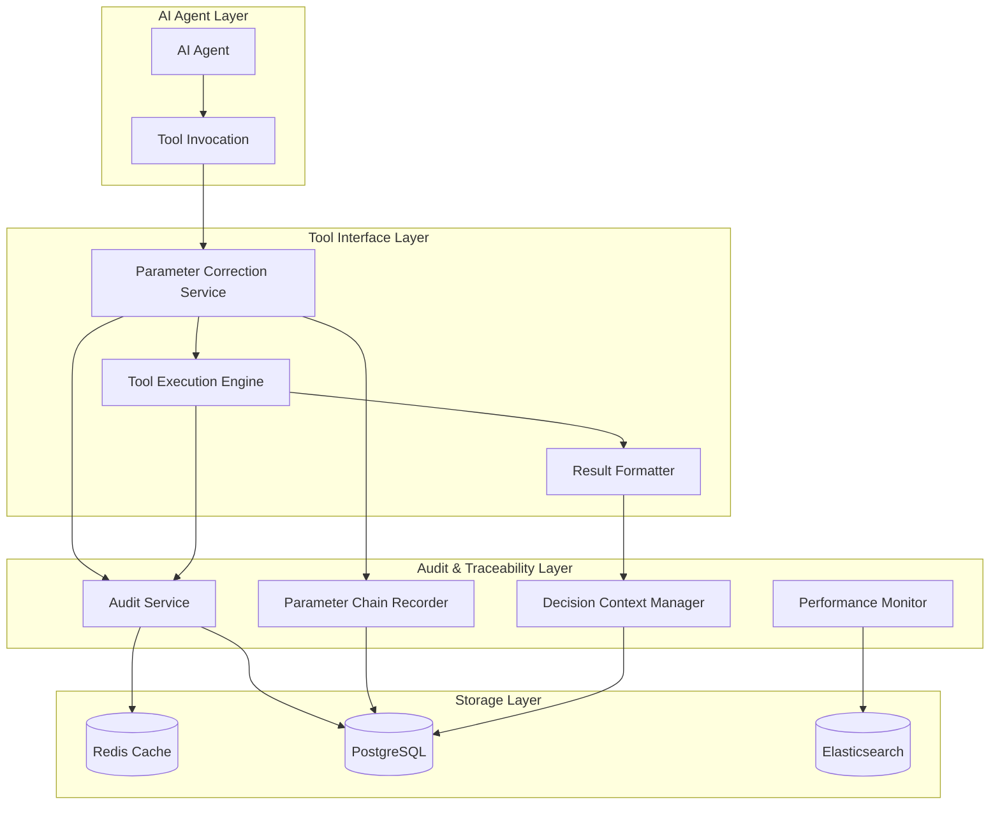

# Design Document

## Overview

本设计文档描述了工具接口标准化和审计可回溯系统的技术架构。系统将在现有的 `ToolExecutionResult`
基础上，构建完整的审计轨迹记录、参数解析链路保存和决策上下文管理功能，确保AI Agent的所有工具调用都具备完整的可追溯性。

## Architecture

### 系统架构图



### 核心组件

1. **Enhanced ToolExecutionResult**: 扩展现有返回结构，增加审计元数据
2. **Audit Service**: 异步审计日志记录服务
3. **Parameter Chain Recorder**: 参数转换链路记录器
4. **Decision Context Manager**: 决策上下文管理器
5. **Performance Monitor**: 性能监控和告警组件

## Components and Interfaces

### 1. Enhanced ToolExecutionResult

```java
public record EnhancedToolExecutionResult(
    String status,                    // ok | ambiguous | not_found | error | needs_confirmation
    Object payload,                   // 执行结果或候选数据
    String explain,                   // 自然语言解释
    AuditMetadata auditMetadata,      // 审计元数据
    ParameterChain parameterChain,    // 参数转换链
    DecisionContext decisionContext,  // 决策上下文
    PerformanceMetrics metrics        // 性能指标
) {
    // 向后兼容的构造方法
    public static EnhancedToolExecutionResult fromLegacy(ToolExecutionResult legacy) {
        return new EnhancedToolExecutionResult(
            legacy.status(),
            legacy.payload(),
            legacy.explain(),
            null, null, null, null
        );
    }
}
```

### 2. Audit Service Interface

```java
public interface AuditService {
    /**
     * 记录工具调用审计日志
     */
    CompletableFuture<Void> recordToolExecution(ToolExecutionAudit audit);
    
    /**
     * 查询审计轨迹
     */
    List<ToolExecutionAudit> queryAuditTrail(AuditQuery query);
    
    /**
     * 获取会话审计摘要
     */
    SessionAuditSummary getSessionSummary(String sessionId);
}
```

### 3. Parameter Chain Recorder Interface

```java
public interface ParameterChainRecorder {
    /**
     * 记录参数转换链
     */
    void recordParameterChain(String executionId, ParameterChain chain);
    
    /**
     * 查询参数转换历史
     */
    List<ParameterChain> queryParameterHistory(ParameterQuery query);
    
    /**
     * 分析参数转换模式
     */
    ParameterPatternAnalysis analyzePatterns(String toolName, Duration timeRange);
}
```

### 4. Decision Context Manager Interface

```java
public interface DecisionContextManager {
    /**
     * 保存决策上下文
     */
    void saveDecisionContext(String sessionId, DecisionContext context);
    
    /**
     * 获取相关决策历史
     */
    List<DecisionContext> getRelatedDecisions(DecisionQuery query);
    
    /**
     * 建议一致性决策
     */
    DecisionSuggestion suggestConsistentDecision(DecisionRequest request);
}
```

## Data Models

### AuditMetadata

```java
public record AuditMetadata(
    String executionId,           // 执行唯一标识
    String traceId,              // 分布式追踪ID
    String sessionId,            // 会话ID
    String userId,               // 用户ID
    Instant timestamp,           // 执行时间戳
    String toolName,             // 工具名称
    String methodName,           // 方法名称
    Map<String, Object> context  // 执行上下文
) {}
```

### ParameterChain

```java
public record ParameterChain(
    String executionId,                    // 执行ID
    List<ParameterTransformation> steps,   // 转换步骤
    Map<String, Object> originalParams,    // 原始参数
    Map<String, Object> finalParams,       // 最终参数
    double overallConfidence,              // 整体置信度
    List<String> appliedRules             // 应用的规则
) {}

public record ParameterTransformation(
    String parameterName,        // 参数名
    Object originalValue,        // 原始值
    Object transformedValue,     // 转换后值
    String transformationType,   // 转换类型
    double confidence,           // 置信度
    String reason,              // 转换原因
    Map<String, Object> metadata // 转换元数据
) {}
```

### DecisionContext

```java
public record DecisionContext(
    String sessionId,                    // 会话ID
    String toolName,                     // 工具名称
    Map<String, Object> parameters,      // 参数
    String decision,                     // 决策结果
    double confidence,                   // 决策置信度
    List<String> alternatives,           // 备选方案
    Map<String, Object> contextFactors,  // 上下文因素
    Instant timestamp                    // 决策时间
) {}
```

### PerformanceMetrics

```java
public record PerformanceMetrics(
    Duration executionTime,        // 执行时间
    Duration parameterCorrectionTime, // 参数修正时间
    int parameterTransformations,  // 参数转换次数
    boolean cacheHit,             // 缓存命中
    Map<String, Object> customMetrics // 自定义指标
) {}
```

## Correctness Properties

*A property is a characteristic or behavior that should hold true across all valid executions of a system-essentially, a
formal statement about what the system should do. Properties serve as the bridge between human-readable specifications
and machine-verifiable correctness guarantees.*

### Property 1: Audit Completeness

*For any* tool execution, the audit service should record all required metadata including execution ID, trace ID,
session ID, and timestamp
**Validates: Requirements 3.1, 3.2**

### Property 2: Parameter Chain Integrity

*For any* parameter transformation chain, the original parameters and final parameters should be preserved with complete
transformation steps
**Validates: Requirements 4.1, 4.2**

### Property 3: Decision Context Consistency

*For any* similar decision scenario within a session, the system should suggest consistent parameter choices based on
historical context
**Validates: Requirements 5.2, 5.6**

### Property 4: Audit Data Immutability

*For any* audit record, once written it should be immutable and tamper-evident
**Validates: Requirements 7.2**

### Property 5: Performance Impact Minimization

*For any* tool execution, audit logging should not increase response time by more than 10%
**Validates: Requirements 6.1**

### Property 6: Data Retention Compliance

*For any* audit record, it should be automatically archived or deleted according to configured retention policies
**Validates: Requirements 6.5, 7.5**

### Property 7: Sensitive Data Protection

*For any* parameter containing sensitive information, it should be masked or encrypted in audit logs
**Validates: Requirements 7.1, 7.4**

### Property 8: Query Performance

*For any* audit query, response time should be under 500ms for standard queries and under 2s for complex analytical
queries
**Validates: Requirements 6.6**

## Error Handling

### 审计服务错误处理

1. **异步处理失败**: 使用重试机制和死信队列
2. **存储服务不可用**: 降级到本地文件存储
3. **数据序列化错误**: 记录错误并使用简化格式
4. **权限验证失败**: 记录安全事件并拒绝访问

### 参数链记录错误处理

1. **转换步骤记录失败**: 保留核心信息，跳过详细元数据
2. **存储空间不足**: 触发数据清理和归档流程
3. **并发写入冲突**: 使用乐观锁和重试机制

### 决策上下文错误处理

1. **历史数据查询失败**: 降级到基础决策逻辑
2. **一致性检查超时**: 返回默认建议并记录警告
3. **上下文数据损坏**: 重建上下文或使用备份数据

## Testing Strategy

### Unit Testing

- 测试各个组件的核心功能
- 验证数据模型的序列化和反序列化
- 测试错误处理和边界条件
- 验证性能指标计算的准确性

### Property-Based Testing

- **Property 1**: 审计完整性测试
    - 生成随机工具执行场景
    - 验证所有必需的审计元数据都被正确记录
    - **Feature: tool-interface-standardization, Property 1: Audit Completeness**

- **Property 2**: 参数链完整性测试
    - 生成随机参数转换序列
    - 验证转换链的完整性和一致性
    - **Feature: tool-interface-standardization, Property 2: Parameter Chain Integrity**

- **Property 3**: 决策一致性测试
    - 生成相似的决策场景
    - 验证系统建议的一致性
    - **Feature: tool-interface-standardization, Property 3: Decision Context Consistency**

- **Property 4**: 数据不可变性测试
    - 尝试修改已写入的审计记录
    - 验证数据的不可变性和完整性检查
    - **Feature: tool-interface-standardization, Property 4: Audit Data Immutability**

- **Property 5**: 性能影响测试
    - 测量启用和禁用审计功能的性能差异
    - 验证性能影响在可接受范围内
    - **Feature: tool-interface-standardization, Property 5: Performance Impact Minimization**

### Integration Testing

- 测试审计服务与存储层的集成
- 验证分布式追踪的端到端功能
- 测试监控和告警系统的集成
- 验证数据归档和清理流程

### Performance Testing

- 高并发场景下的审计性能测试
- 大数据量查询的性能测试
- 存储空间增长和清理效率测试
- 系统资源使用情况监控

### Security Testing

- 敏感数据掩码和加密测试
- 权限控制和访问审计测试
- 数据完整性和防篡改测试
- 合规性要求验证测试