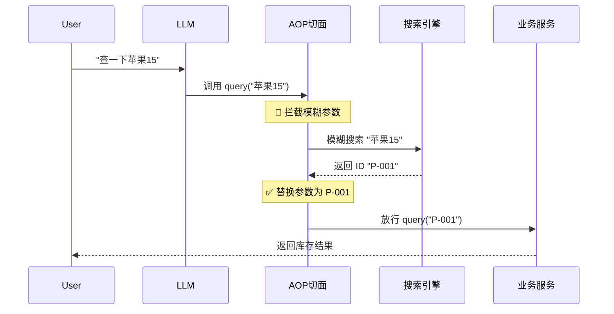
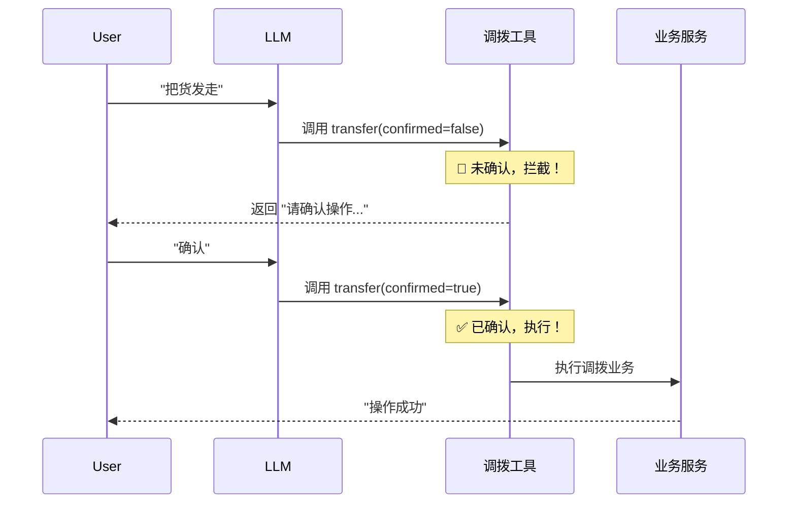

# 智能仓储系统 (Spring AI Demo) - 架构与流程总结文档

## 1. 项目概述

本项目是一个基于 **Spring AI** 和 **Spring Boot** 构建的智能仓储管理系统 Demo。它展示了如何构建生产级的大模型应用，特别是如何解决 Function Calling（工具调用）中的常见痛点：**参数不准确**和**操作安全性**。

### 核心特性
*   **智能工具发现**: 自动扫描并注册所有 `@Bean` 定义的 `Function` 工具。
*   **混合调用策略**:
    *   **读操作 (查询)**: 采用 **参数矫正策略**，自动修复用户模糊的输入。
    *   **写操作 (调拨)**: 采用 **人机确认策略**，防止 AI 误操作。
*   **RAG (检索增强生成)**: (可选) 结合向量数据库提供知识库问答能力。

| **P2** | **架构拆分** | ✅ 已完成 | 拆分 `RagService` 和 `PromptManager` |
| **P2** | **测试覆盖** | ⏳ 待开始 | 补充 AI 组件的单元测试与集成测试 |

---

## 2. 系统架构

系统采用标准的分层架构，并在 Service 层和 Tool 层之间引入了 AOP 切面作为"智能中间件"。

```mermaid
graph TD
    User[用户] --> Controller[AiController]
    Controller --> Service[AiService]
    
    subgraph "核心逻辑层"
        Service --> LLM[ChatClient (通义千问/Ollama)]
        Service --> Registry[ToolRegistry (工具注册中心)]
    end
    
    subgraph "工具执行层"
        LLM -- 调用工具 --> AOP[ArgumentCorrectionAspect (参数矫正切面)]
        
        AOP -- 1. 拦截查询 --> Search[MockSearchService (模拟搜索引擎)]
        AOP -- 2. 矫正参数 --> Tools[InventoryTools (库存工具集)]
        
        Tools -- 3. 确认逻辑 --> Tools
        Tools -- 4. 执行业务 --> Biz[InventoryService (库存业务服务)]
    end
```

---

## 3. 核心组件详解

### 3.1 AiService (智能服务入口)
*   **职责**: 负责与 LLM 交互，管理对话上下文，处理 RAG 检索（如果启用），并挂载可用工具。
*   **关键点**:
    *   通过 `ToolRegistry` 获取所有可用工具名称。
    *   使用 `.toolNames()` 将工具注册给 LLM。
    *   (可选) 实现 RAG 流程：检索 -> 重排序 -> 注入 System Prompt。

### 3.2 ToolRegistry (工具注册中心)
*   **职责**: 自动发现 Spring 容器中所有的 `Function` Bean。
*   **实现**:
    *   扫描 `ApplicationContext` 中所有 `Function.class` 类型的 Bean。
    *   提供 `availableToolNames()` 供 `AiService` 使用。
    *   **优化**: 移除了复杂的注解检查，直接信任所有 Function Bean，简化了注册流程。

### 3.3 InventoryTools (工具定义)
*   **职责**: 定义供 LLM 调用的具体函数接口。
*   **包含工具**:
    *   `queryStock`: 查询库存（配合 AOP 使用）。
    *   `transferStock`: 调拨库存（内置两阶段确认逻辑）。

### 3.4 ArgumentCorrectionAspect (参数矫正切面 - 策略一)
*   **职责**: **拦截**查询请求，解决"用户输入模糊"的问题。
*   **逻辑**:
    1.  拦截 `queryStock` 调用。
    2.  获取原始参数（如 "苹果15"）。
    3.  调用 `MockSearchService` 进行模糊搜索。
    4.  **决策**:
        *   **唯一匹配**: 偷梁换柱，将参数替换为精确 ID ("P-001")，放行。
        *   **歧义**: 拦截调用，返回提示 "找到多个商品..."。
        *   **无匹配**: 拦截调用，返回提示 "未找到..."。

### 3.5 InventoryTools.transferStock (人机确认 - 策略二)
*   **职责**: **保护**写操作，防止 AI 幻觉导致的数据损坏。
*   **逻辑**:
    1.  定义 DTO `TransferRequest`，包含 `Boolean confirmed` 字段。
    2.  **阶段一**: 当 `confirmed=false` (默认) 时，**不执行业务**，只返回确认文案。
    3.  **阶段二**: 用户确认后，LLM 再次调用且 `confirmed=true`，此时才调用 `InventoryService` 执行真实操作。

---

## 4. 业务流程图解

### 4.1 智能查询流程 (读操作)



### 4.2 安全调拨流程 (写操作)



---

## 5. 关键配置与依赖

### 5.1 Maven 依赖
为了支持 AOP 切面，必须在 `pom.xml` 中添加：
```xml
<dependency>
    <groupId>org.springframework.boot</groupId>
    <artifactId>spring-boot-starter-aop</artifactId>
</dependency>
```

### 5.2 配置文件 (application.yml)
配置 LLM API Key 和 RAG 参数：
```yaml
spring:
  ai:
    dashscope:
      api-key: ${DASHSCOPE_API_KEY}

ai:
  rag:
    topK: 8
    similarityThreshold: 0.4
```

---

## 6. 总结

本项目通过引入 **AOP 切面** 和 **两阶段提交** 机制，成功解决了 LLM 在实际业务落地中的两个核心难题：

1.  **听不懂人话**: 通过 AOP + 搜索引擎，让系统能理解模糊的自然语言参数。
2.  **乱操作**: 通过确认机制，为 AI 的行为加上了安全锁。

这套架构具有低侵入性（业务逻辑无需修改）、高扩展性（可轻松添加新工具）的特点，适合作为企业级 AI 应用的基础框架。
