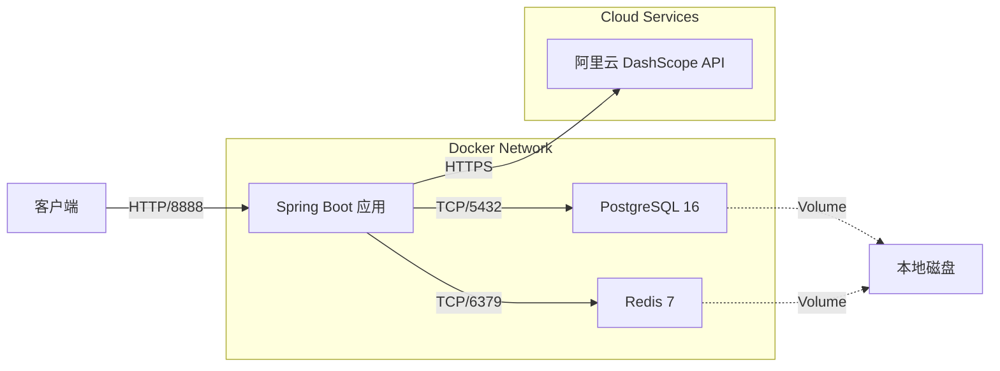
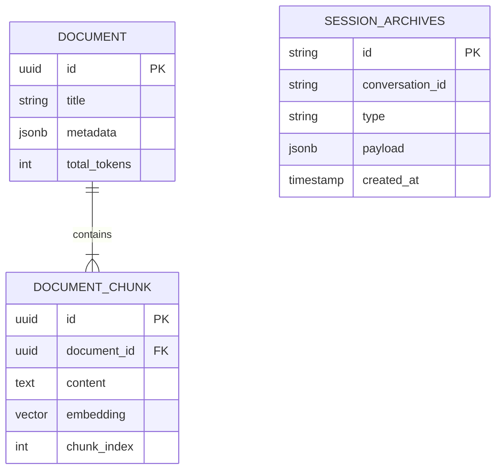

# Enterprise AI Agent Platform - 技术白皮书 (Ultimate Edition)

> **文档版本**: 3.0.0 (Final)  
> **项目代号**: Spring AI Demo (Enterprise)  
> **最后更新**: 2025-12-03

---

## 📑 目录

1.  [项目愿景与摘要](#1-项目愿景与摘要)
2.  [技术栈与选型标准](#2-技术栈与选型标准)
3.  [系统架构设计](#3-系统架构设计)
4.  [核心子系统详解](#4-核心子系统详解)
5.  [数据架构与治理](#5-数据架构与治理)
6.  [非功能性设计 (NFR)](#6-非功能性设计-nfr)
7.  [开发与运维指南](#7-开发与运维指南)

---

## 1. 项目愿景与摘要

本项目旨在构建一个**生产级、可扩展、高可靠**的企业智能 Agent 平台。不同于简单的 LLM 包装器，本平台致力于解决企业落地 AI 应用时的核心痛点：

*   **长窗口记忆**: 突破 LLM Context Window 限制，实现无限轮次的对话记忆。
*   **私有知识融合**: 通过 RAG 技术，让 AI 安全地访问和理解企业内部文档。
*   **确定性交互**: 通过 AOP 切面和模糊搜索，消除 AI 工具调用的幻觉和参数错误。
*   **全链路可观测**: 提供从会话开始到归档结束的全生命周期数据追踪。

---

## 2. 技术栈与选型标准

我们坚持 "主流、稳定、高性能" 的选型原则。

| 领域 | 组件 | 版本 | 选型理由 |
| :--- | :--- | :--- | :--- |
| **核心框架** | Spring Boot | **3.3.5** | 事实上的 Java 企业级标准，生态丰富。 |
| **AI SDK** | Spring AI | **1.0.0** | Spring 官方出品，提供统一的 Model/Vector/RAG 抽象。 |
| **LLM 模型** | Alibaba DashScope | **qwen-max** | 通义千问 Max，中文能力强，性价比高。 |
| **向量存储** | PostgreSQL + PGVector | **PG 16** | 关系型+向量一体化，减少运维复杂度，支持 ACID。 |
| **会话缓存** | Redis | **7.0** | 高性能 KV 存储，支持 List/Stream 等复杂数据结构。 |
| **ORM 框架** | MyBatis Plus | **3.5.9** | 开发效率高，国内开发者友好。 |
| **JSON 处理** | Jackson | **2.15+** | 高性能 JSON 序列化，支持 Java 8 Time API。 |
| **构建工具** | Maven | **3.8+** | 标准依赖管理。 |
| **容器化** | Docker Compose | **v2** | 基础设施即代码 (IaC)，一键拉起环境。 |

---

## 3. 系统架构设计

### 3.1 逻辑架构图 (Logical Architecture)

系统采用分层架构设计，确保各层职责单一，耦合度低。

```mermaid
graph TD
    subgraph "接入层 (Access Layer)"
        API[REST API / SSE]
        Auth[认证鉴权 (Planning)]
    end

    subgraph "编排层 (Orchestration Layer)"
        AiService[AI 核心服务]
        ContextMgr[上下文管理]
        ToolDispatch[工具分发]
    end

    subgraph "能力层 (Capability Layer)"
        RAG[RAG 检索增强]
        Memory[会话记忆]
        Correction[参数矫正 AOP]
        Inventory[库存服务]
    end

    subgraph "存储层 (Storage Layer)"
        Redis[(Redis Cluster)]
        PG[(PostgreSQL 16)]
        Vector[(PGVector)]
    end

    subgraph "模型层 (Model Layer)"
        LLM[Qwen-Max]
        Embed[Text-Embedding-V3]
    end

    API --> AiService
    AiService --> ContextMgr
    AiService --> ToolDispatch
    
    ContextMgr --> Memory
    Memory --> Redis
    Memory --> PG
    
    ToolDispatch --> Correction
    Correction --> Inventory
    
    AiService --> RAG
    RAG --> Vector
    RAG --> Embed
    
    AiService --> LLM
```

### 3.2 部署架构图 (Infrastructure)



---

## 4. 核心子系统详解

### 4.1 智能会话记忆系统 (Intelligent Session Memory)

**设计目标**: 实现低延迟的上下文读写，并支持无限长度的对话归档。

*   **三级存储架构**:
    1.  **L1 热存储 (Redis List)**:
        *   Key: `session:messages:{chatId}`
        *   Value: JSON 序列化的 `SessionMessage`
        *   策略: **滑动窗口 (Sliding Window)**。每次读取时，倒序遍历 List，累加 Token 数，直到达到 `max-prompt-tokens` (4000)。这确保了无论对话多长，发送给 LLM 的上下文永远是最新的且不超限。
    2.  **L2 元数据 (Redis Hash)**:
        *   Key: `session:meta:{chatId}`
        *   Fields: `totalTokens`, `msgCount`, `lastActive`
        *   作用: 实时监控会话状态，无需遍历 List。
    3.  **L3 归档流 (Redis Stream)**:
        *   Key: `session:global-stream`
        *   作用: **Write-Ahead Log (WAL)**。所有产生的消息都会异步写入此 Stream，由后台消费者批量写入 PostgreSQL。这解耦了在线业务和离线存储。

### 4.2 企业级 RAG 知识库 (Enterprise RAG)

**设计目标**: 让 AI 精准回答私有领域问题，且具备可追溯性。

*   **双表设计模式**:
    *   我们将文档拆分为 **元数据 (`document`)** 和 **切片 (`document_chunk`)** 两张表。
    *   **优势**: 可以在不加载向量数据的情况下快速检索文档列表；支持对切片进行精细化的溯源（如"答案来自第 3 页第 2 段"）。
*   **智能切片策略**:
    *   使用 `TokenTextSplitter`。
    *   **Chunk Size**: 500 tokens (平衡了语义完整性和检索粒度)。
    *   **Overlap**: 50 tokens (防止关键信息被切断)。
*   **检索与重排序**:
    *   **Retrieve**: 使用 HNSW 索引进行向量相似度搜索 (Cosine Distance)。
    *   **Rerank**: (架构已预留) 引入 Cross-Encoder 模型对召回结果进行精排，提升准确率。

### 4.3 鲁棒工具调用与参数矫正 (Robust Tooling)

**设计目标**: 消除 LLM 调用工具时的"幻觉"和参数错误。

*   **AOP 切面防护**:
    *   定义 `ArgumentCorrectionAspect` 切面，拦截所有 `@Tool` 方法。
    *   **流程**:
        1.  拦截工具调用，获取参数 (如 `product="苹果15"`).
        2.  检测参数是否模糊或不标准。
        3.  调用 `MockSearchService` 进行模糊搜索。
        4.  **自动修复**: 如果找到唯一匹配 (如 "iPhone 15 Pro")，直接替换参数并放行。
        5.  **歧义阻断**: 如果找到多个匹配，抛出异常或返回提示，要求用户确认。
*   **Human-in-the-loop**:
    *   对于敏感操作（如库存调拨），系统不直接执行，而是返回一个 `PENDING` 状态的请求对象，前端展示确认框，用户点击后才真正执行。

### 4.4 异步文档摄入 (Async Document Ingestion)

**设计目标**: 支持大文件上传，避免阻塞主线程，提供实时进度追踪。

*   **架构设计**: 基于 **Redis Stream** 的异步任务队列。
*   **实现细节**:
    1.  **上传**: 用户通过 `POST /ai/knowledge/upload` 上传文件。
    2.  **存储**: 文件保存到本地 `uploads/` 目录。
    3.  **初始化状态**: 在 Redis Hash (`ingestion:status:{id}`) 中记录 `PENDING` 状态。
    4.  **发布任务**: 将 `IngestionTask` 发布到 Redis Stream (`ingestion:stream`)。
    5.  **异步处理**: 
        *   `IngestionConsumer` 监听 Stream。
        *   使用 **Apache Tika** 解析文档（支持 PDF, Word, Excel 等）。
        *   调用 `DocumentSplitter` 切分文本。
        *   调用 `KnowledgeBaseService` 向量化并存储。
        *   每个阶段更新 Redis 状态（PROCESSING 10% -> 40% -> 90% -> COMPLETED）。
    6.  **状态查询**: 用户通过 `GET /ai/knowledge/status/{id}` 轮询进度。
*   **优势**: 
    *   非阻塞：上传接口立即返回。
    *   可靠：基于 Redis Stream 的 Consumer Group 机制，确保消息不丢失。
    *   可观测：实时进度追踪。

---

## 5. 数据架构与治理

### 5.1 ER 关系图



### 5.2 关键表结构定义

#### 1. `document_chunk` (向量切片表)
| 字段名 | 类型 | 索引 | 说明 |
| :--- | :--- | :--- | :--- |
| `id` | UUID | PK | 主键 |
| `document_id` | UUID | BTREE | 关联父文档 |
| `content` | TEXT | - | 切片原始文本 |
| `embedding` | VECTOR(1536) | **HNSW** | 向量数据 (核心) |
| `metadata` | JSONB | GIN | 结构化元数据 |

#### 2. `session_archives` (会话归档表)
| 字段名 | 类型 | 索引 | 说明 |
| :--- | :--- | :--- | :--- |
| `id` | VARCHAR | PK | 事件 ID |
| `conversation_id` | VARCHAR | BTREE | 会话 ID |
| `payload` | JSONB | - | 完整消息体 (JSON) |
| `timestamp` | TIMESTAMP | BTREE | 发生时间 |

---

## 6. 非功能性设计 (NFR)

### 6.1 性能优化
*   **连接池**: 使用 `Lettuce` 连接池管理 Redis 连接，使用 `HikariCP` 管理数据库连接。
*   **索引优化**: 向量表使用 HNSW 索引，相比 IVFFlat 查询性能更高，适合生产环境。
*   **异步处理**: 归档操作完全异步化（Redis Stream），不阻塞主聊天线程。

### 6.2 可靠性
*   **数据持久化**: Redis 开启 RDB/AOF，PostgreSQL 负责最终持久化。
*   **异常处理**: 全局异常处理器捕获 LLM 调用失败、网络超时等错误，返回友好的错误码。

### 6.3 可观测性 (Planning)
*   **Metrics**: 集成 Micrometer，暴露 `redis_latency`, `vector_search_duration` 等指标。
*   **Tracing**: 预留 OpenTelemetry 接入点，追踪跨服务调用链路。

---

## 7. 开发与运维指南

### 7.1 项目结构
```
src/main/java/org/zerolg/aidemo2
├── aspect/             # AOP 切面 (参数矫正)
├── config/             # 配置类 (Redis, AI, Web)
├── controller/         # Web 接口层
├── entity/             # 数据库实体 (MyBatis Plus)
├── mapper/             # DAO 接口
├── model/              # 领域模型 (DTO, VO)
├── service/            # 业务逻辑层
│   ├── impl/           # 实现类
│   ├── stream/         # Redis Stream 消费者
│   └── ...
└── tools/              # AI Function Tools
```

### 7.2 快速启动
1.  **环境准备**: 确保已安装 Docker 和 JDK 17。
2.  **启动基础设施**:
    ```bash
    docker-compose up -d
    ```
3.  **配置密钥**: 在 `application.yml` 中填入 `spring.ai.dashscope.api-key`。
4.  **运行应用**:
    ```bash
    ./mvnw spring-boot:run
    ```

### 7.3 API 参考
*   `POST /ai/chat`: 核心对话接口 (SSE)。
*   `POST /ai/knowledge/ingest`: 文档摄入接口。
*   `GET /ai/knowledge/search`: 向量检索调试接口。

---

**Zerolg Team** | Empowering Enterprise with AI
