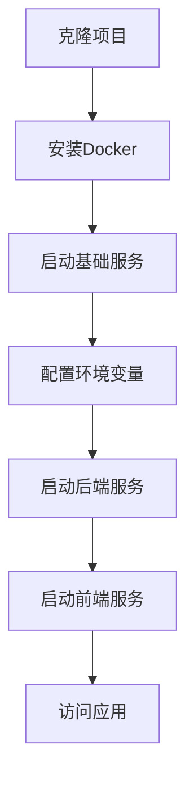
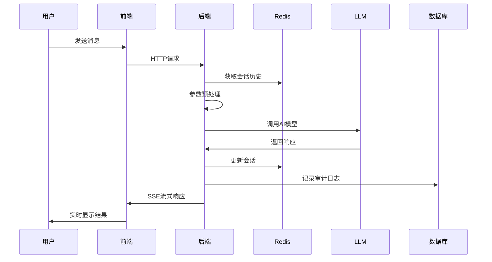
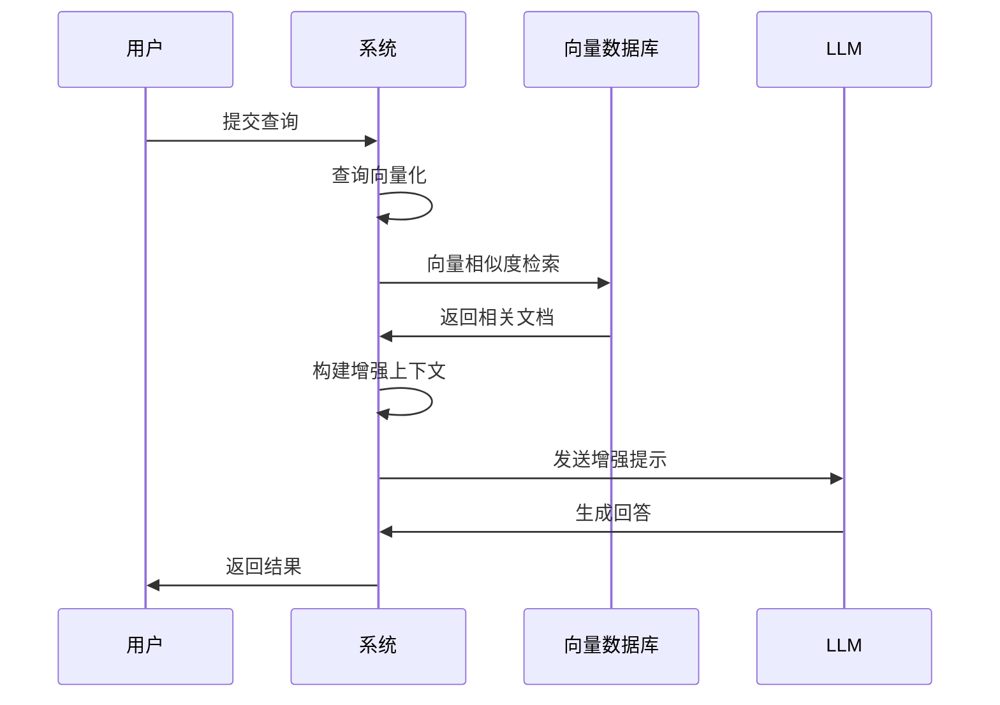

# Spring AI Demo 2 - 企业级AI应用开发平台

## 📋 项目概述

Spring AI Demo 2 是一个基于 Spring Boot 3.x 和 Spring AI
框架构建的企业级AI应用开发平台。该项目展示了如何构建一个完整的AI驱动的应用系统，集成了大语言模型(LLM)
、向量数据库、知识库管理、参数自动纠错、审计监控等核心功能。

### 🎯 核心价值

- **企业级AI应用架构**: 提供完整的AI应用开发框架和最佳实践
- **智能参数纠错**: 自动识别和修正LLM工具调用中的参数错误
- **RAG知识库系统**: 支持文档上传、向量化存储和语义检索
- **全链路审计监控**: 完整记录AI工具调用链路，支持性能分析和问题诊断
- **会话记忆管理**: 智能的对话上下文管理和历史归档
- **可视化监控面板**: 实时监控系统状态和AI工具执行情况

## 🚀 核心功能

### ✅ 已完成功能

#### 1. AI对话系统

- **多模型支持**: 集成阿里云通义千问、本地Ollama模型
- **流式响应**: 支持Server-Sent Events(SSE)实时流式输出
- **上下文记忆**: 基于Redis的会话记忆管理
- **工具调用**: 支持Function Calling，可调用外部工具和API

#### 2. RAG知识库系统

- **文档解析**: 支持PDF、Word、Excel、TXT等多种格式文档
- **智能分块**: 基于语义的文档分块策略
- **向量存储**: 使用PGVector进行高效向量存储和检索
- **语义搜索**: 基于向量相似度的智能文档检索

#### 3. 智能参数纠错系统

- **自动参数校正**: 使用LLM自动识别和修正参数错误
- **多层验证**: 类型验证、范围验证、业务逻辑验证
- **参数标准化**: 日期、数字、字符串等类型的智能标准化
- **歧义处理**: 智能处理参数歧义和不确定性

#### 4. 全链路审计监控

- **执行链路追踪**: 完整记录工具调用的参数转换链路
- **性能监控**: 记录执行时间、成功率等关键指标
- **决策上下文**: 记录AI决策过程和推理依据
- **可视化面板**: 提供直观的监控和分析界面

#### 5. 会话管理系统

- **Redis缓存**: 热数据存储在Redis中，提供快速访问
- **数据库归档**: 冷数据自动归档到PostgreSQL
- **会话恢复**: 支持长期会话历史的查询和恢复
- **流式处理**: 使用Redis Stream处理会话事件

#### 6. 系统监控

- **健康检查**: 实时监控各组件健康状态
- **性能指标**: 监控CPU、内存、数据库连接等系统指标
- **告警机制**: 支持异常情况的自动告警
- **可视化展示**: 提供实时的系统状态面板

## 🏗️ 技术栈

### 后端技术栈

| 技术               | 版本    | 用途      |
|------------------|-------|---------|
| **Java**         | 17    | 核心开发语言  |
| **Spring Boot**  | 3.3.5 | 应用框架    |
| **Spring AI**    | 1.0.0 | AI集成框架  |
| **PostgreSQL**   | 16    | 关系型数据库  |
| **PGVector**     | -     | 向量数据库扩展 |
| **Redis**        | 7.0   | 缓存和消息队列 |
| **MyBatis Plus** | 3.5.9 | ORM框架   |
| **Apache Tika**  | 2.9.2 | 文档解析    |
| **Jackson**      | -     | JSON处理  |
| **Lombok**       | -     | 代码简化    |

### 前端技术栈

| 技术               | 版本      | 用途         |
|------------------|---------|------------|
| **Vue.js**       | 3.4.27  | 前端框架       |
| **TypeScript**   | 5.2.2   | 类型安全       |
| **Element Plus** | 2.7.3   | UI组件库      |
| **ECharts**      | 5.4.3   | 数据可视化      |
| **Axios**        | 1.6.8   | HTTP客户端    |
| **Vite**         | 5.2.11  | 构建工具       |
| **Marked**       | 17.0.1  | Markdown渲染 |
| **Highlight.js** | 11.11.1 | 代码高亮       |

### AI模型支持

- **阿里云通义千问**: 主要的大语言模型
- **本地Ollama**: 支持本地部署的开源模型
- **文本嵌入模型**: 用于文档向量化

## 🏛️ 系统架构

### 整体架构图

```
┌─────────────────────────────────────────────────────────────────┐
│                        前端层 (Vue.js)                          │
├─────────────────────────────────────────────────────────────────┤
│  AI对话界面  │  知识库管理  │  系统监控  │  审计监控  │  参数测试   │
└─────────────────────────────────────────────────────────────────┘
                                  │
                                  │ HTTP/WebSocket
                                  ▼
┌─────────────────────────────────────────────────────────────────┐
│                      应用服务层 (Spring Boot)                    │
├─────────────────────────────────────────────────────────────────┤
│                                                                 │
│  ┌─────────────┐  ┌─────────────┐  ┌─────────────┐  ┌─────────┐ │
│  │ AI对话服务  │  │ RAG检索服务 │  │ 参数纠错服务│  │审计服务 │ │
│  └─────────────┘  └─────────────┘  └─────────────┘  └─────────┘ │
│                                                                 │
│  ┌─────────────┐  ┌─────────────┐  ┌─────────────┐  ┌─────────┐ │
│  │ 会话管理    │  │ 文档解析    │  │ 向量存储    │  │监控服务 │ │
│  └─────────────┘  └─────────────┘  └─────────────┘  └─────────┘ │
│                                                                 │
└─────────────────────────────────────────────────────────────────┘
                                  │
                    ┌─────────────┼─────────────┐
                    │             │             │
                    ▼             ▼             ▼
┌─────────────────┐ ┌─────────────┐ ┌─────────────┐ ┌─────────────┐
│   Redis缓存     │ │ PostgreSQL  │ │  PGVector   │ │  AI模型API  │
│                 │ │   数据库    │ │  向量数据库 │ │             │
│ • 会话缓存      │ │ • 业务数据  │ │ • 文档向量  │ │ • 通义千问  │
│ • 消息队列      │ │ • 审计日志  │ │ • 语义检索  │ │ • 本地模型  │
│ • 分布式锁      │ │ • 归档数据  │ │ • 相似度计算│ │             │
└─────────────────┘ └─────────────┘ └─────────────┘ └─────────────┘
```

### 核心组件架构

#### 1. AI对话系统架构

```
用户输入 → 参数纠错 → LLM处理 → 工具调用 → 结果返回
    ↓         ↓         ↓         ↓         ↓
  会话管理   参数验证   上下文管理  审计记录   流式输出
```

#### 2. RAG知识库架构

```
文档上传 → 格式解析 → 文本分块 → 向量化 → 存储索引
                                    ↓
用户查询 → 查询向量化 → 相似度检索 → 结果排序 → 上下文增强
```

#### 3. 参数纠错系统架构

```
原始参数 → 类型检测 → 格式标准化 → 业务验证 → LLM纠错 → 最终参数
    ↓         ↓          ↓          ↓         ↓         ↓
  参数链记录 → 转换日志 → 验证结果 → 决策上下文 → 纠错记录 → 审计存储
```

## 🔄 项目流程

### 1. 开发环境搭建流程


```mermaid
graph TD
    A[克隆项目] --> B[安装Docker]
    B --> C[启动基础服务]
    C --> D[配置环境变量]
    D --> E[启动后端服务]
    E --> F[启动前端服务]
    F --> G[访问应用]
```

### 2. AI对话处理流程


```mermaid
sequenceDiagram
    participant U as 用户
    participant F as 前端
    participant B as 后端
    participant R as Redis
    participant L as LLM
    participant D as 数据库
    
    U->>F: 发送消息
    F->>B: HTTP请求
    B->>R: 获取会话历史
    B->>B: 参数预处理
    B->>L: 调用AI模型
    L->>B: 返回响应
    B->>R: 更新会话
    B->>D: 记录审计日志
    B->>F: SSE流式响应
    F->>U: 实时显示结果
```

### 3. 知识库检索流程


```mermaid
sequenceDiagram
    participant U as 用户
    participant S as 系统
    participant V as 向量数据库
    participant L as LLM
    
    U->>S: 提交查询
    S->>S: 查询向量化
    S->>V: 向量相似度检索
    V->>S: 返回相关文档
    S->>S: 构建增强上下文
    S->>L: 发送增强提示
    L->>S: 生成回答
    S->>U: 返回结果
```

## 🎯 运行逻辑

### 1. 系统启动逻辑

1. **基础服务启动**: Docker Compose启动PostgreSQL、Redis等基础服务
2. **数据库初始化**: 执行init.sql脚本，创建表结构和索引
3. **Spring Boot启动**: 加载配置、初始化Bean、建立数据库连接
4. **AI模型连接**: 连接到配置的AI模型服务
5. **前端服务启动**: Vue.js应用启动，连接后端API

### 2. 请求处理逻辑

#### AI对话请求处理

```java
@PostMapping("/chat")
public ResponseEntity<SseEmitter> chat(@RequestBody ChatRequest request) {
    // 1. 创建SSE连接
    SseEmitter emitter = new SseEmitter();
    
    // 2. 异步处理
    CompletableFuture.runAsync(() -> {
        try {
            // 3. 获取会话历史
            List<Message> history = sessionService.getHistory(request.getSessionId());
            
            // 4. 参数预处理和纠错
            String correctedInput = parameterCorrectionService.correct(request.getMessage());
            
            // 5. 构建AI请求
            ChatRequest aiRequest = buildChatRequest(correctedInput, history);
            
            // 6. 调用AI模型
            aiService.streamChat(aiRequest, response -> {
                // 7. 实时推送响应
                emitter.send(response);
                
                // 8. 更新会话
                sessionService.addMessage(request.getSessionId(), response);
            });
            
            // 9. 记录审计日志
            auditService.recordExecution(request, response);
            
        } catch (Exception e) {
            emitter.completeWithError(e);
        } finally {
            emitter.complete();
        }
    });
    
    return ResponseEntity.ok(emitter);
}
```

#### 知识库检索逻辑

```java
@Service
public class RagService {
    
    public String retrieveAndGenerate(String query) {
        // 1. 查询向量化
        List<Double> queryVector = embeddingService.embed(query);
        
        // 2. 向量相似度检索
        List<DocumentChunk> relevantChunks = vectorStore.similaritySearch(
            queryVector, 
            SIMILARITY_THRESHOLD, 
            MAX_RESULTS
        );
        
        // 3. 构建增强上下文
        String context = buildContext(relevantChunks);
        
        // 4. 生成增强提示
        String enhancedPrompt = buildRagPrompt(query, context);
        
        // 5. 调用LLM生成回答
        String response = aiService.generate(enhancedPrompt);
        
        // 6. 记录检索日志
        auditService.recordRetrieval(query, relevantChunks, response);
        
        return response;
    }
}
```

### 3. 数据流转逻辑

#### 会话数据流转

```
用户消息 → Redis缓存 → 定期归档 → PostgreSQL存储
    ↓           ↓           ↓            ↓
  实时访问    热数据存储   冷数据迁移    长期保存
```

#### 审计数据流转

```
工具执行 → 实时记录 → Redis Stream → 异步处理 → 数据库存储
    ↓         ↓          ↓           ↓          ↓
  参数链    执行日志    消息队列    批量处理    持久化存储
```

## 🔧 核心系统详解

### 1. 参数自动纠错系统

#### 系统架构

参数纠错系统采用多层架构设计，包含以下核心组件：

- **参数验证器**: 类型验证、范围验证、格式验证
- **参数标准化器**: 日期、数字、字符串标准化
- **LLM纠错器**: 使用AI模型进行智能纠错
- **歧义处理器**: 处理参数歧义和不确定性
- **审计记录器**: 记录完整的参数转换链路

#### 核心特性

```java
@ParameterCorrection
public class InventoryService {
    
    @ParameterCorrection(
        validators = {TypeValidator.class, RangeValidator.class},
        normalizers = {NumberNormalizer.class},
        ambiguityHandler = DefaultAmbiguityHandler.class
    )
    public InventoryResult queryStock(
        @PositiveNumber String productId,
        @DateRange String dateRange
    ) {
        // 业务逻辑
    }
}
```

#### 纠错流程

1. **参数接收**: 接收原始参数
2. **类型检测**: 检测参数类型和格式
3. **标准化处理**: 统一参数格式
4. **业务验证**: 执行业务规则验证
5. **LLM纠错**: 使用AI模型智能纠错
6. **结果验证**: 验证纠错结果
7. **审计记录**: 记录完整转换链路

### 2. RAG知识库系统

#### 文档处理流程

```java
@Service
public class KnowledgeIngestionService {
    
    public void ingestDocument(MultipartFile file) {
        // 1. 文档解析
        ParsedDocument document = tikaParser.parse(file);
        
        // 2. 智能分块
        List<DocumentChunk> chunks = smartSplitter.split(
            document.getContent(),
            CHUNK_SIZE,
            OVERLAP_SIZE
        );
        
        // 3. 向量化处理
        for (DocumentChunk chunk : chunks) {
            List<Double> embedding = embeddingService.embed(chunk.getContent());
            chunk.setEmbedding(embedding);
        }
        
        // 4. 存储到向量数据库
        vectorStore.save(chunks);
        
        // 5. 更新元数据
        documentService.updateMetadata(document.getId(), chunks.size());
    }
}
```

#### 检索策略

- **向量相似度检索**: 基于余弦相似度的语义检索
- **混合检索**: 结合关键词检索和向量检索
- **重排序**: 使用重排序模型优化检索结果
- **上下文窗口管理**: 智能管理上下文长度

### 3. 会话记忆系统

#### 分层存储架构

```java
@Service
public class SessionMemoryService {
    
    // 热数据存储 - Redis
    @Autowired
    private RedisTemplate<String, Object> redisTemplate;
    
    // 冷数据存储 - PostgreSQL
    @Autowired
    private SessionArchiveService archiveService;
    
    public void addMessage(String sessionId, Message message) {
        // 1. 存储到Redis热缓存
        String key = RedisKeys.SESSION_MESSAGES + sessionId;
        redisTemplate.opsForList().rightPush(key, message);
        
        // 2. 设置过期时间
        redisTemplate.expire(key, Duration.ofHours(24));
        
        // 3. 异步归档处理
        if (shouldArchive(sessionId)) {
            archiveService.archiveSession(sessionId);
        }
    }
}
```

#### 记忆管理策略

- **滑动窗口**: 维护固定大小的对话窗口
- **重要性评分**: 基于重要性保留关键对话
- **压缩存储**: 对历史对话进行智能压缩
- **检索增强**: 支持历史对话的语义检索

### 4. 审计监控系统

#### 审计数据模型

```java
@Entity
public class ToolExecutionAudit {
    private String executionId;          // 执行ID
    private String toolName;             // 工具名称
    private String sessionId;            // 会话ID
    private Map<String, Object> originalParams;  // 原始参数
    private Map<String, Object> finalParams;     // 最终参数
    private List<ParameterChain> parameterChain; // 参数转换链
    private ExecutionStatus status;      // 执行状态
    private Long executionTime;          // 执行时间
    private String errorMessage;         // 错误信息
    private DecisionContext decisionContext; // 决策上下文
}
```

#### 监控指标

- **执行统计**: 总执行次数、成功率、失败率
- **性能指标**: 平均执行时间、P95、P99响应时间
- **参数分析**: 参数纠错率、歧义处理率
- **工具使用**: 各工具的使用频率和成功率

### 5. 系统监控

#### 健康检查

```java
@Component
public class SystemHealthIndicator implements HealthIndicator {
    
    @Override
    public Health health() {
        Health.Builder builder = new Health.Builder();
        
        // 检查数据库连接
        if (isDatabaseHealthy()) {
            builder.up().withDetail("database", "Available");
        } else {
            builder.down().withDetail("database", "Unavailable");
        }
        
        // 检查Redis连接
        if (isRedisHealthy()) {
            builder.up().withDetail("redis", "Available");
        } else {
            builder.down().withDetail("redis", "Unavailable");
        }
        
        // 检查AI模型连接
        if (isAiModelHealthy()) {
            builder.up().withDetail("ai-model", "Available");
        } else {
            builder.down().withDetail("ai-model", "Unavailable");
        }
        
        return builder.build();
    }
}
```

## 🗄️ 数据库设计

### 核心表结构

#### 1. 向量存储表 (vector_store)

```sql
CREATE TABLE vector_store
(
    id UUID PRIMARY KEY DEFAULT uuid_generate_v4(),
    content TEXT NOT NULL, -- 文档内容
    metadata JSONB,        -- 元数据
    embedding VECTOR(1536) -- 向量嵌入
);

-- 向量相似度检索索引
CREATE INDEX ON vector_store USING HNSW (embedding vector_cosine_ops);
```

#### 2. 文档管理表 (document)

```sql
CREATE TABLE document (
    id UUID PRIMARY KEY DEFAULT uuid_generate_v4(),
    title VARCHAR(255) NOT NULL,             -- 文档标题
    source_url VARCHAR(1024),                -- 来源URL
    file_path VARCHAR(1024),                 -- 文件路径
    mime_type VARCHAR(100),                  -- MIME类型
    total_tokens INTEGER,                    -- 总token数
    chunk_count INTEGER,                     -- 分块数量
    metadata JSONB,                          -- 扩展元数据
    created_at TIMESTAMP WITH TIME ZONE DEFAULT CURRENT_TIMESTAMP,
    updated_at TIMESTAMP WITH TIME ZONE DEFAULT CURRENT_TIMESTAMP,
    is_deleted BOOLEAN DEFAULT FALSE         -- 软删除标记
);
```

#### 3. 文档分块表 (document_chunk)

```sql
CREATE TABLE document_chunk (
    id UUID PRIMARY KEY DEFAULT uuid_generate_v4(),
    document_id UUID REFERENCES document(id), -- 关联文档
    content TEXT NOT NULL,                    -- 分块内容
    embedding VECTOR(1536),                   -- 向量表示
    token_count INTEGER,                      -- token数量
    chunk_index INTEGER,                      -- 分块序号
    metadata JSONB,                          -- 分块元数据
    created_at TIMESTAMP WITH TIME ZONE DEFAULT CURRENT_TIMESTAMP
);

-- 性能优化索引
CREATE INDEX ON document_chunk USING HNSW (embedding vector_cosine_ops);
CREATE INDEX ON document_chunk (document_id);
CREATE INDEX ON document_chunk USING GIN (metadata);
```

#### 4. 审计日志表 (tool_execution_audit)

```sql
CREATE TABLE tool_execution_audit (
    id VARCHAR(36) PRIMARY KEY,
    tool_name VARCHAR(255) NOT NULL,         -- 工具名称
    session_id VARCHAR(255),                 -- 会话ID
    original_params JSONB,                   -- 原始参数
    final_params JSONB,                      -- 最终参数
    execution_status VARCHAR(50),            -- 执行状态
    execution_time_ms BIGINT,                -- 执行时间
    error_message TEXT,                      -- 错误信息
    created_at TIMESTAMP WITH TIME ZONE DEFAULT CURRENT_TIMESTAMP
);

-- 查询优化索引
CREATE INDEX ON tool_execution_audit (tool_name);
CREATE INDEX ON tool_execution_audit (session_id);
CREATE INDEX ON tool_execution_audit (created_at);
```

#### 5. 会话归档表 (session_archives)

```sql
CREATE TABLE session_archives (
    id VARCHAR(36) PRIMARY KEY,
    conversation_id VARCHAR(255) NOT NULL,   -- 会话ID
    type VARCHAR(50) NOT NULL,               -- 记录类型
    payload JSONB NOT NULL,                  -- 数据载荷
    timestamp TIMESTAMP WITH TIME ZONE NOT NULL, -- 原始时间戳
    created_at TIMESTAMP WITH TIME ZONE DEFAULT CURRENT_TIMESTAMP -- 归档时间
);

-- 查询优化索引
CREATE INDEX ON session_archives (conversation_id);
CREATE INDEX ON session_archives (timestamp);
```

### 数据库优化策略

#### 1. 索引优化

- **HNSW索引**: 用于向量相似度检索，提供高性能的近似最近邻搜索
- **GIN索引**: 用于JSONB字段的复杂查询
- **复合索引**: 针对常用查询组合创建复合索引

#### 2. 分区策略

```sql
-- 按时间分区审计表
CREATE TABLE tool_execution_audit_y2024m01 PARTITION OF tool_execution_audit
FOR VALUES FROM ('2024-01-01') TO ('2024-02-01');
```

#### 3. 数据清理

```sql
-- 定期清理过期数据
DELETE FROM session_archives 
WHERE created_at < NOW() - INTERVAL '90 days';
```

## 🚀 快速开始

### 1. 环境要求

- **Java**: 17+
- **Node.js**: 16+
- **Docker**: 20+
- **Docker Compose**: 2.0+

### 2. 克隆项目

```bash
git clone https://github.com/your-repo/spring-aidemo.git
cd spring-aidemo
```

### 3. 启动基础服务

```bash
# 启动PostgreSQL和Redis
docker-compose up -d
```

### 4. 配置环境变量

创建 `.env` 文件：

```env
# AI模型配置
DASHSCOPE_API_KEY=your_dashscope_api_key

# 数据库配置
SPRING_DATASOURCE_URL=jdbc:postgresql://localhost:5432/aidemo
SPRING_DATASOURCE_USERNAME=postgres
SPRING_DATASOURCE_PASSWORD=postgres

# Redis配置
SPRING_REDIS_HOST=localhost
SPRING_REDIS_PORT=6379
```

### 5. 启动后端服务

```bash
# 使用Maven启动
./mvnw spring-boot:run

# 或者使用IDE启动 AiDemo2Application.java
```

### 6. 启动前端服务

```bash
cd web/spring-aidemo-frontend
npm install
npm run dev
```

### 7. 访问应用

- **前端应用**: http://localhost:5173
- **后端API**: http://localhost:8080
- **Redis管理**: http://localhost:8081
- **API文档**: http://localhost:8080/swagger-ui.html

## 📊 监控面板

### 1. 系统监控面板

访问 `http://localhost:5173` 点击"系统监控"查看：

- **系统健康状态**: 数据库、Redis、AI模型连接状态
- **性能指标**: CPU、内存、响应时间等
- **业务指标**: 会话数量、消息数量、文档数量等

### 2. 审计监控面板

访问 `http://localhost:5173` 点击"审计监控"查看：

- **执行统计**: 工具调用次数、成功率、失败率
- **性能分析**: 执行时间分布、响应时间趋势
- **参数分析**: 参数纠错统计、歧义处理情况
- **详细日志**: 完整的执行链路和参数转换过程

## 🔧 配置说明

### 1. AI模型配置

```yaml
spring:
  ai:
    dashscope:
      api-key: ${DASHSCOPE_API_KEY}
      chat:
        model: qwen-plus
        temperature: 0.7
        max-tokens: 2000
```

### 2. 向量数据库配置

```yaml
spring:
  ai:
    vectorstore:
      pgvector:
        dimensions: 1536
        distance-type: COSINE
        remove-existing-vector-store-table: false
```

### 3. Redis配置

```yaml
spring:
  redis:
    host: ${SPRING_REDIS_HOST:localhost}
    port: ${SPRING_REDIS_PORT:6379}
    timeout: 2000ms
    lettuce:
      pool:
        max-active: 8
        max-idle: 8
        min-idle: 0
```

### 4. 会话配置

```yaml
session:
  memory:
    max-messages: 50
    ttl-hours: 24
    archive-threshold: 100
```

## 🧪 测试指南

### 1. 功能测试

#### AI对话测试

```bash
curl -X POST http://localhost:8080/api/ai/chat \
  -H "Content-Type: application/json" \
  -d '{
    "message": "你好，请介绍一下这个系统",
    "sessionId": "test-session-001"
  }'
```

#### 知识库测试

```bash
# 上传文档
curl -X POST http://localhost:8080/api/knowledge/upload \
  -F "file=@test-document.pdf"

# 检索测试
curl -X POST http://localhost:8080/api/knowledge/search \
  -H "Content-Type: application/json" \
  -d '{
    "query": "系统架构",
    "limit": 5
  }'
```

#### 参数纠错测试

```bash
curl -X POST http://localhost:8080/api/test/parameter-correction \
  -H "Content-Type: application/json" \
  -d '{
    "productId": "产品A",
    "quantity": "五个",
    "date": "明天"
  }'
```

### 2. 性能测试

使用JMeter或类似工具进行压力测试：

- **并发用户**: 100-500
- **测试时间**: 10-30分钟
- **关键指标**: 响应时间、吞吐量、错误率

### 3. 集成测试

```java
@SpringBootTest
@TestPropertySource(locations = "classpath:application-test.properties")
class AiServiceIntegrationTest {
    
    @Test
    void testChatWithParameterCorrection() {
        // 测试AI对话和参数纠错集成
    }
    
    @Test
    void testRagRetrieval() {
        // 测试RAG检索功能
    }
    
    @Test
    void testAuditRecording() {
        // 测试审计记录功能
    }
}
```

## 🚀 部署指南

### 1. Docker部署

```dockerfile
# Dockerfile
FROM openjdk:17-jdk-slim

COPY target/aidemo2-0.0.1-SNAPSHOT.jar app.jar

EXPOSE 8080

ENTRYPOINT ["java", "-jar", "/app.jar"]
```

```yaml
# docker-compose.prod.yml
version: '3.8'
services:
  app:
    build: .
    ports:
      - "8080:8080"
    environment:
      - SPRING_PROFILES_ACTIVE=prod
    depends_on:
      - postgres
      - redis
```

### 2. Kubernetes部署

```yaml
apiVersion: apps/v1
kind: Deployment
metadata:
  name: aidemo-app
spec:
  replicas: 3
  selector:
    matchLabels:
      app: aidemo
  template:
    metadata:
      labels:
        app: aidemo
    spec:
      containers:
      - name: aidemo
        image: aidemo:latest
        ports:
        - containerPort: 8080
        env:
        - name: SPRING_PROFILES_ACTIVE
          value: "k8s"
```

### 3. 生产环境配置

```yaml
# application-prod.yml
spring:
  datasource:
    hikari:
      maximum-pool-size: 20
      minimum-idle: 5
  redis:
    lettuce:
      pool:
        max-active: 20
        max-idle: 10

logging:
  level:
    org.zerolg.aidemo2: INFO
  file:
    name: /var/log/aidemo/application.log

management:
  endpoints:
    web:
      exposure:
        include: health,info,metrics,prometheus
```

## 🔍 故障排查

### 1. 常见问题

#### 数据库连接失败

```bash
# 检查PostgreSQL状态
docker-compose ps postgres

# 查看日志
docker-compose logs postgres
```

#### Redis连接失败

```bash
# 检查Redis状态
docker-compose ps redis

# 测试连接
redis-cli -h localhost -p 6379 ping
```

#### AI模型调用失败

```bash
# 检查API密钥配置
echo $DASHSCOPE_API_KEY

# 查看应用日志
tail -f logs/application.log | grep -i "dashscope"
```

### 2. 性能问题

#### 数据库性能优化

```sql
-- 查看慢查询
SELECT query, mean_time, calls 
FROM pg_stat_statements 
ORDER BY mean_time DESC 
LIMIT 10;

-- 分析查询计划
EXPLAIN ANALYZE SELECT * FROM document_chunk 
WHERE embedding <-> '[0.1,0.2,...]' < 0.5;
```

#### Redis性能监控

```bash
# 监控Redis性能
redis-cli --latency-history -h localhost -p 6379

# 查看内存使用
redis-cli info memory
```

### 3. 日志分析

```bash
# 查看错误日志
grep -i "error" logs/application.log

# 查看审计日志
grep -i "audit" logs/application.log

# 实时监控日志
tail -f logs/application.log | grep -E "(ERROR|WARN)"
```

## 🤝 贡献指南

### 1. 开发规范

- **代码风格**: 遵循Google Java Style Guide
- **提交规范**: 使用Conventional Commits格式
- **测试覆盖**: 新功能需要包含单元测试和集成测试
- **文档更新**: 重要功能需要更新相关文档

### 2. 提交流程

```bash
# 1. Fork项目
git fork https://github.com/your-repo/spring-aidemo.git

# 2. 创建功能分支
git checkout -b feature/new-feature

# 3. 提交代码
git commit -m "feat: add new feature"

# 4. 推送分支
git push origin feature/new-feature

# 5. 创建Pull Request
```

