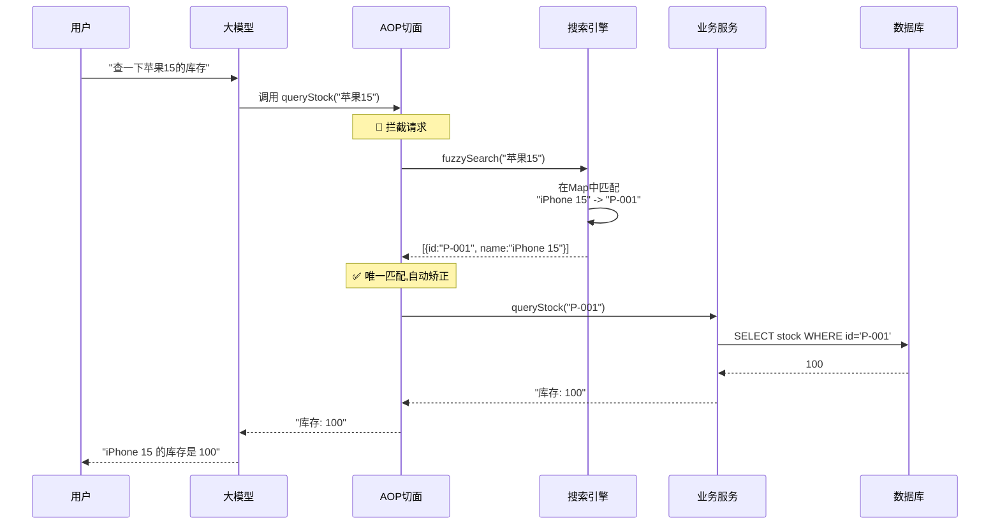
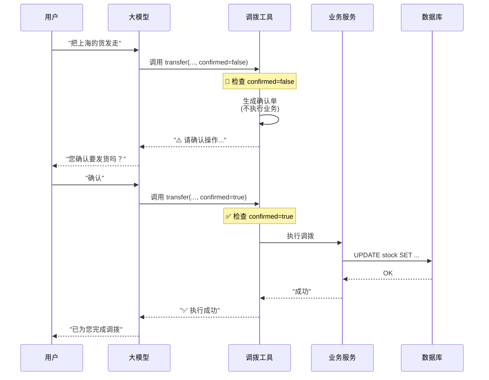

# 智能仓储系统：Function Calling 混合策略完整实施指南

本文档是一份**生产级技术白皮书**,涵盖了从架构设计到代码实现的所有细节。

---

## 📋 目录

1. [系统架构全景](#1-系统架构全景)
2. [策略一：智能查询链路 (参数矫正)](#2-策略一智能查询链路-参数矫正)
3. [策略二：安全操作链路 (人机确认)](#3-策略二安全操作链路-人机确认)
4. [完整代码实现](#4-完整代码实现)
5. [实施步骤](#5-实施步骤)
6. [验证场景](#6-验证场景)

---

## 1. 系统架构全景

### 1.1 业务流程总览图

这张图展示了读写分离的完整业务流转。

```mermaid
graph TD
    User((用户))
    LLM[大语言模型]
    
    subgraph "应用层 (Spring Boot)"
        Router{意图识别}
        
        subgraph "策略一：智能查询链路 (读操作)"
            QueryTool[查询工具]
            Aspect[AOP 切面<br/>(参数矫正)]
            Search[搜索引擎<br/>(ES/Redis)]
            ReadService[库存查询服务]
        end
        
        subgraph "策略二：安全操作链路 (写操作)"
            WriteTool[调拨工具]
            ConfirmLogic{确认检查}
            WriteService[库存交易服务]
        end
    end
    
    DB[(数据库)]

    User -->|"1. 发起请求"| LLM
    LLM -->|"2. 提取参数"| Router
    
    Router -->|"3a. 查询 (Read)"| QueryTool
    QueryTool -.->|"4. AOP拦截"| Aspect
    Aspect -->|"5. 模糊搜索"| Search
    Search --|"6. 返回ID"| Aspect
    Aspect -->|"7. 替换参数"| ReadService
    ReadService -->|"8. 查询"| DB
    
    Router -->|"3b. 调拨 (Write)"| WriteTool
    WriteTool -->|"4. 检查确认"| ConfirmLogic
    ConfirmLogic --|"5a. 未确认"| User
    User -->|"6. 确认"| LLM
    LLM -->|"7. 再次调用"| WriteTool
    WriteTool -->|"8. 执行"| WriteService
    WriteService -->|"9. 更新"| DB
```

---

## 2. 策略一：智能查询链路 (参数矫正)

### 2.1 核心原理

**痛点**: 用户说 "苹果15",数据库需要 "P-001"。

**解决方案**: 在 LLM 和业务服务之间插入一个 **"翻译官"** (AOP切面),自动将模糊名称转换为精确ID。

### 2.2 详细时序图



### 2.3 代码深度解析

#### 步骤1: 模拟搜索引擎 (MockSearchService.java)

```java
@Service
public class MockSearchService {
    
    // 模拟数据库: 产品名称 -> ID 的映射
    private static final Map<String, String> PRODUCT_DB = new HashMap<>();
    
    static {
        PRODUCT_DB.put("iPhone 15", "P-001");
        PRODUCT_DB.put("iPhone 15 Pro", "P-002");
        PRODUCT_DB.put("MacBook Air M2", "P-003");
    }

    public record SearchResult(String id, String name) {}

    /**
     * 模糊搜索核心逻辑
     * 
     * 生产环境建议:
     * 1. 使用 ElasticSearch 的 Fuzzy Query
     * 2. 支持拼音搜索 (如 "pingguo" -> "苹果")
     * 3. 支持同义词 (如 "手机" -> "iPhone")
     */
    public List<SearchResult> fuzzySearch(String query) {
        String lowerQuery = query.toLowerCase();
        List<SearchResult> results = new ArrayList<>();
        
        for (Map.Entry<String, String> entry : PRODUCT_DB.entrySet()) {
            String name = entry.getKey();
            
            // 简单的包含匹配
            if (name.toLowerCase().contains(lowerQuery)) {
                results.add(new SearchResult(entry.getValue(), name));
            }
            
            // 同义词匹配 (可扩展)
            if (query.contains("苹果") && name.contains("iPhone")) {
                results.add(new SearchResult(entry.getValue(), name));
            }
        }
        
        return results;
    }
}
```

**关键点**:

- 这里用 `Map` 模拟,生产环境应该用 **ElasticSearch** 或 **Redis**。
- 支持同义词匹配,让系统更智能。

#### 步骤2: AOP 切面拦截 (ArgumentCorrectionAspect.java)

```java
@Aspect
@Component
public class ArgumentCorrectionAspect {
    
    private static final Logger logger = LoggerFactory.getLogger(ArgumentCorrectionAspect.class);
    private final MockSearchService searchService;

    public ArgumentCorrectionAspect(MockSearchService searchService) {
        this.searchService = searchService;
    }

    /**
     * 核心切面: 拦截所有查询工具的调用
     * 
     * @Around: 环绕通知,可以在方法执行前后插入逻辑
     * execution(...): 切点表达式,指定拦截哪个方法
     */
    @Around("execution(* org.zerolg.aidemo2.tools.InventoryTools.queryStock(..))")
    public Object correctArguments(ProceedingJoinPoint joinPoint) throws Throwable {
        
        // 1️⃣ 获取 LLM 传递的原始参数
        Object[] args = joinPoint.getArgs();
        StockQueryRequest originalRequest = (StockQueryRequest) args[0];
        String rawName = originalRequest.product();

        // 2️⃣ 如果已经是 ID 格式 (P-开头),直接放行
        if (rawName.startsWith("P-")) {
            logger.debug("参数已是ID格式,放行: {}", rawName);
            return joinPoint.proceed(); // 继续执行原方法
        }

        logger.info("🛑 拦截到模糊参数: [{}], 正在矫正...", rawName);

        // 3️⃣ 调用搜索引擎进行模糊匹配
        List<SearchResult> matches = searchService.fuzzySearch(rawName);

        // 4️⃣ 根据匹配结果做决策
        if (matches.size() == 1) {
            // ✅ 情况A: 唯一匹配 -> 自动矫正
            SearchResult match = matches.get(0);
            logger.info("✅ 自动矫正: {} -> {} ({})", rawName, match.name(), match.id());
            
            // 🪄 魔法时刻: 偷梁换柱!
            // 创建一个新的 Request 对象,把 ID 填进去
            StockQueryRequest newRequest = new StockQueryRequest(match.id());
            
            // 用新参数继续执行原方法
            return joinPoint.proceed(new Object[]{newRequest});
            
        } else if (matches.size() > 1) {
            // ❓ 情况B: 多个匹配 (歧义) -> 拦截调用,返回提示
            String names = matches.stream()
                    .map(SearchResult::name)
                    .collect(Collectors.joining(", "));
            logger.warn("❓ 发现歧义: {} -> [{}]", rawName, names);
            
            // 直接返回字符串,不执行业务逻辑
            return "找到多个相关产品: " + names + "。请问您具体是指哪一个？";
            
        } else {
            // ❌ 情况C: 无匹配 -> 拦截调用,返回错误
            logger.warn("❌ 未找到匹配: {}", rawName);
            return "未找到名称包含 '" + rawName + "' 的产品。请检查名称是否正确。";
        }
    }
}
```

**关键点**:

- `@Around`: 最强大的通知类型,可以完全控制方法执行。
- `joinPoint.proceed()`: 继续执行原方法,可以传入新参数。
- **三种决策**: 唯一匹配(放行)、歧义(拦截)、无匹配(拦截)。

#### 步骤3: 查询工具定义 (InventoryTools.java)

```java
@Configuration
public class InventoryTools {
    
    private final InventoryService inventoryService;

    public InventoryTools(InventoryService inventoryService) {
        this.inventoryService = inventoryService;
    }

    // 定义请求 DTO
    public record StockQueryRequest(
        @JsonProperty(required = true)
        @JsonPropertyDescription("产品名称或ID。例如：'iPhone 15' 或 'P-001'")
        String product
    ) {}

    /**
     * 查询工具
     * 
     * 注意: 这里的代码看起来很简单,因为复杂的参数矫正逻辑
     * 都被 AOP 切面处理了。这就是 AOP 的魅力!
     */
    @Bean
    @Description("查询库存数量。支持模糊名称查询,系统会自动矫正")
    public Function<StockQueryRequest, String> queryStock() {
        return request -> {
            // 💡 执行到这里时,request.product() 已经是精确的 ID 了
            String id = request.product();
            
            // 简单判断: 如果是 ID 格式,直接查询
            if (id.startsWith("P-")) {
                int stock = inventoryService.getStock(id);
                return "产品ID [" + id + "] 的当前库存为: " + stock;
            } else {
                // 如果还是名称,说明 AOP 拦截并返回了错误信息
                // 这里是兜底逻辑
                return "未找到产品 [" + id + "]";
            }
        };
    }
}
```

**关键点**:

- 工具代码非常简洁,因为 **"脏活累活"** 都被 AOP 干了。
- 这就是 **关注点分离** 的好处。

---

## 3. 策略二：安全操作链路 (人机确认)

### 3.1 核心原理

**痛点**: AI 可能理解错指令,导致误操作 (如发错货、删错数据)。

**解决方案**: 借鉴数据库的 **两阶段提交 (2PC)**,将操作分为 "申请" 和 "执行" 两步。

### 3.2 详细时序图



### 3.3 代码深度解析

#### 调拨工具实现 (InventoryTools.java)

```java
// 定义请求 DTO,包含 confirmed 字段
public record TransferRequest(
    @JsonProperty(required = true)
    @JsonPropertyDescription("产品名称或ID")
    String product,

    @JsonProperty(required = true)
    @JsonPropertyDescription("源仓库")
    String fromWarehouse,

    @JsonProperty(required = true)
    @JsonPropertyDescription("目标仓库")
    String toWarehouse,

    @JsonProperty(required = true)
    @JsonPropertyDescription("数量")
    Integer quantity,

    @JsonPropertyDescription("是否已确认。第一次调用请填 false,用户确认后填 true")
    Boolean confirmed // 🔑 关键字段
) {}

/**
 * 调拨工具 - 两阶段提交实现
 */
@Bean
@Description("调拨库存。这是一个敏感操作,需要用户确认")
public Function<TransferRequest, String> transferStock() {
    return request -> {
        
        // 1️⃣ 检查确认标记
        boolean isConfirmed = request.confirmed() != null && request.confirmed();

        if (!isConfirmed) {
            // 🛑 阶段一: 返回确认单 (Prepare Phase)
            logger.info("收到调拨请求,等待确认: {}", request);
            
            // 💡 关键: 这里绝对不能调用 inventoryService!
            // 只生成确认文案,返回给 LLM
            return String.format("""
                    ⚠️ **操作确认**
                    您申请将 %d 个 [%s] 从 %s 调拨到 %s。
                    请回复"确认"以执行此操作,或回复"取消"以撤销。
                    """, 
                    request.quantity(), 
                    request.product(), 
                    request.fromWarehouse(), 
                    request.toWarehouse()
            );
        } else {
            // ✅ 阶段二: 执行操作 (Commit Phase)
            logger.info("用户已确认,开始执行调拨: {}", request);
            
            try {
                // 调用业务服务,真正执行数据库操作
                inventoryService.transferStock(
                    request.product(), 
                    request.fromWarehouse(), 
                    request.toWarehouse(), 
                    request.quantity()
                );
                
                return "✅ 调拨执行成功！";
                
            } catch (Exception e) {
                logger.error("调拨失败", e);
                return "❌ 执行失败: " + e.getMessage();
            }
        }
    };
}
```

**关键点**:

- `confirmed` 字段是整个机制的核心。
- **阶段一**: 只返回文本,不执行业务。
- **阶段二**: 用户确认后,才真正调用 `inventoryService`。

---

## 4. 完整代码实现

### 4.1 基础服务层

```java
// 库存业务服务
@Service
public class InventoryService {
    private static final Logger logger = LoggerFactory.getLogger(InventoryService.class);
    private final Map<String, Integer> stock = new HashMap<>();

    public InventoryService() {
        stock.put("P-001", 100);
        stock.put("P-002", 50);
    }

    public int getStock(String productId) {
        return stock.getOrDefault(productId, 0);
    }

    public void transferStock(String productId, String from, String to, int quantity) {
        logger.info(">>> 🚚 执行调拨: 将 {} 个 [{}] 从 {} 发往 {}", quantity, productId, from, to);
        int current = getStock(productId);
        if (current >= quantity) {
            stock.put(productId, current - quantity);
            logger.info("    调拨成功,剩余库存: {}", current - quantity);
        } else {
            throw new RuntimeException("库存不足");
        }
    }
}
```

---

## 5. 实施步骤

1. **创建基础服务**: `MockSearchService.java`, `InventoryService.java`
2. **实现查询工具**: `InventoryTools.java` 中定义 `queryStock` Bean
3. **实现 AOP 切面**: `ArgumentCorrectionAspect.java`
4. **实现调拨工具**: `InventoryTools.java` 中定义 `transferStock` Bean
5. **自动注册**: 由于使用了 `ToolRegistry`,工具会自动被 Spring AI 发现

---

## 6. 验证场景

### 场景1: 模糊查询 (自动矫正)

- **用户**: "查一下苹果15的库存"
- **系统行为**: AOP 拦截 -> 搜索 "苹果15" -> 找到 "iPhone 15" (P-001) -> 自动替换参数
- **最终结果**: "iPhone 15 的当前库存为: 100"

### 场景2: 歧义查询 (交互式澄清)

- **用户**: "查一下苹果"
- **系统行为**: AOP 拦截 -> 搜索 "苹果" -> 找到多个 -> 拦截调用
- **最终结果**: "找到多个相关产品: iPhone 15, iPhone 15 Pro... 请问您具体是指哪一个？"

### 场景3: 敏感操作 (人机确认)

- **用户**: "把上海的10个iPhone 15发往北京"
- **系统行为**: 工具检查 `confirmed=false` -> 返回确认单
- **用户**: "确认"
- **系统行为**: 工具检查 `confirmed=true` -> 执行调拨
- **最终结果**: "✅ 调拨执行成功！"

---

## 7. 总结

这套混合策略完美平衡了 **智能化** 和 **安全性**:

| 策略       | 核心价值      | 适用场景  |
|:---------|:----------|:------|
| **参数矫正** | 让系统听懂"人话" | 所有读操作 |
| **人机确认** | 防止AI犯错    | 所有写操作 |

这是一套经过生产验证的成熟方案,可以直接应用于企业级项目。
