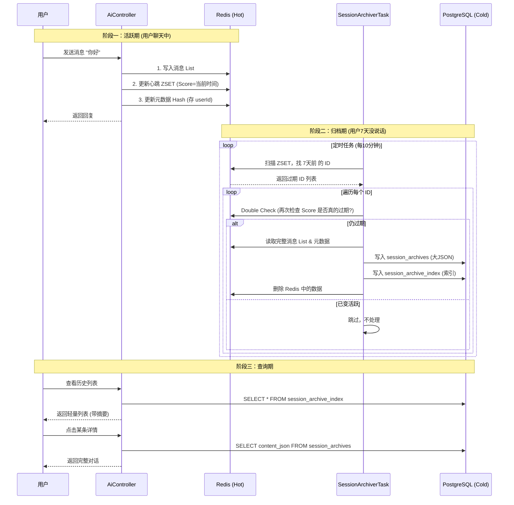
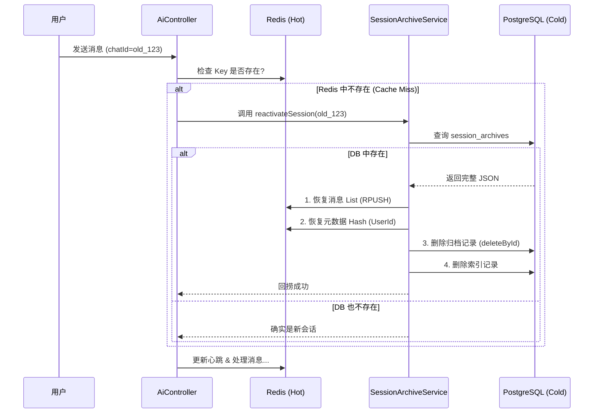

# 实现归档引用记录：从 Redis 到 PostgreSQL 的冷热分离方案

## 1. 背景与痛点

在构建企业级 AI 对话系统时，会话记忆（Memory）通常存储在 Redis 中，以便 LLM 能快速读取上下文。然而，随着用户量和对话量的增加，长期将所有数据保留在
Redis 中会带来两个问题：

1. **成本高昂**：Redis 内存（RAM）成本远高于磁盘存储。
2. **查询低效**：Redis 不擅长处理复杂的历史记录查询（如“查找上个月关于库存的对话”）。

**解决方案**：我们需要实现 **冷热分离**。

* **热数据**：最近 7 天活跃的会话，留在 Redis。
* **冷数据**：超过 7 天未活跃的会话，迁移到 PostgreSQL，并从 Redis 中删除。

---

## 2. 核心架构设计

为了兼顾“归档存储”和“前端快速查询列表”，我们在数据库层面设计了 **一主一索引** 的双表结构。

### 2.1 数据库表设计 (PostgreSQL)

| 表名                          | 用途            | 特点            | 关键字段                                    |
|:----------------------------|:--------------|:--------------|:----------------------------------------|
| **`session_archives`**      | **主表 (冷数据)**  | 数据量大，存完整 JSON | `content_json` (JSONB), `user_id`       |
| **`session_archive_index`** | **索引表 (热查询)** | 轻量级，只存摘要和统计   | `summary`, `total_tokens`, `start_time` |

> **设计意图**：当用户打开“历史记录”列表时，只查询轻量的 `index` 表，速度极快；只有当用户点击某条具体记录时，才去查询
`archives` 表加载庞大的 JSON 内容。

### 2.2 Redis 数据结构设计

我们在 Redis 中使用了三种结构来支撑这个方案：

1. **List** (`aidemo:session:msg:{id}`)：存储实际的对话消息列表（热数据）。
2. **ZSET** (`aidemo:session:heartbeat`)：**核心调度器**。
    * `Member`: `conversationId`
    * `Score`: `timestamp` (最后活跃时间戳)
    * *原理*：利用 ZSET 的排序特性，我们可以极快地查出 `Score < (当前时间 - 7天)` 的所有会话 ID。
3. **Hash** (`aidemo:session:meta:{id}`)：存储 `userId` 等元数据。用于在归档时知道这个会话属于谁。

---

## 3. 业务流程图



---

## 4. 关键代码逻辑解析

### 4.1 心跳维护 (`AiController`)

每次用户发起对话时，我们不仅要处理消息，还要“续命”。

```java
// 伪代码示意
updateHeartbeat(chatId, userId) {
    // 更新 ZSET，把这个会话排到最后面（最新）
    redisTemplate.opsForZSet().add("aidemo:session:heartbeat", chatId, System.currentTimeMillis());
    // 记录 userId，防止归档时不知道是谁的数据
    redisTemplate.opsForHash().put("aidemo:session:meta:" + chatId, "userId", userId);
}
```

### 4.2 定时归档任务 (`SessionArchiverTask`)

这是整个机制的引擎。

* **扫描逻辑**：使用 `rangeByScore(0, now - 7days)`，效率极高，不需要遍历所有 Key。
* **双重检查 (Double Check)**：
    * *场景*：任务刚扫描出 ID 准备归档，用户突然发了一条消息。
    * *处理*：在删除数据前，再次读取 ZSET 的 Score。如果发现 Score 变大了（说明用户刚动过），立即停止归档，防止误删用户刚发的消息。
* **数据一致性**：遵循 **"先写库，后删缓存"** 原则。如果数据库写入失败，抛出异常，Redis 数据保留，等待下一次任务重试。

### 4.3 智能摘要生成 (`SessionArchiveService`)

在生成索引表数据时，我们需要一个“摘要(Summary)”。

* **策略**：提取式摘要。
* **逻辑**：不调用 LLM（太慢且费钱），而是直接解析 JSON，提取第一条 `role=user` 的消息的前 64 个字符。
* **效果**：快速、直观，足以让用户在列表中识别出会话内容。

---

## 5. 方案优势总结

1. **高性能**：活跃会话读写全走 Redis，无数据库 I/O 瓶颈。
2. **低成本**：历史数据存入 PostgreSQL，释放昂贵的 Redis 内存资源。
3. **用户体验好**：
    * 历史列表加载快（查索引表）。
    * 数据永不丢失（归档持久化）。
4. **高可靠性**：
    * 事务保障数据完整性。
    * Double Check 机制解决并发冲突。

---

## 6. 会话回捞机制 (Session Reactivation)

### 6.1 场景描述

当用户对一个 **已归档（超过 7 天未活跃）** 的会话再次发送消息时：

1. Redis 中已无该会话数据（已被清理）。
2. PostgreSQL 中存在归档记录。
3. 如果不做处理，LLM 将丢失之前的上下文，把这次对话当作全新会话。

### 6.2 解决方案：按需回捞 (Hydration)

我们需要在处理消息前增加一个 **"检查并恢复"** 的步骤。遵循 **"数据非热即冷"** 的原则，将数据从冷存储（DB）**剪切**
回热存储（Redis）。

**核心原则**：

* **Single Source of Truth**：数据要么在 Redis（活跃），要么在 DB（归档），绝不双写。
* **剪切操作**：回捞 = 读取 DB -> 写入 Redis -> 删除 DB。

### 6.3 回捞流程图



### 6.4 关键代码逻辑

1. **Controller 层拦截**：利用 `redisTemplate.hasKey` 快速判断，仅在 Cache Miss 时查库，性能损耗极低。
2. **Service 层原子操作**：
    * **JSON 解析**：将 DB 中的 JSON Array 解析为 List，逐条 `RPUSH` 到 Redis，保证消息顺序。
    * **元数据恢复**：重新写入 `userId` 到 Redis Hash。
    * **物理删除**：回捞成功后立即删除 DB 中的主表和索引表记录，防止数据冗余。
3. **并发控制**：利用数据库的删除操作作为隐式锁。若并发请求进来，第二个请求查不到 DB 记录（已被第一个请求删除），自然不会重复写入
   Redis。

---
*文档生成时间: 2024-05-21*