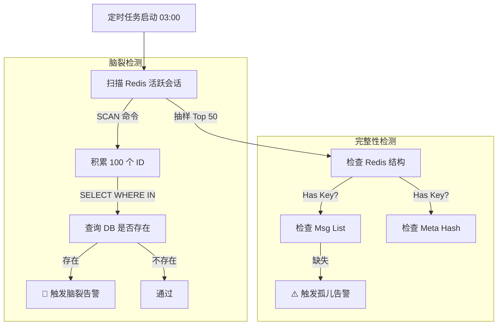

# 数据一致性校验：保障冷热分离架构的最后一道防线

## 1. 背景与核心问题

在我们的 **Redis (热存储)** + **PostgreSQL (冷存储)** 的双层架构中，数据会在两层之间流转（归档与回捞）。虽然我们使用了事务和确认机制，但在分布式环境下，依然存在以下极端异常场景：

### 1.1 "脑裂" (Split Brain)

* **定义**：同一个会话 ID **同时存在**于 Redis 和 PostgreSQL 中。
* **成因**：
    * 归档时：DB 写入成功，但 Redis 删除失败（如网络超时）。
    * 回捞时：Redis 写入成功，但 DB 删除失败。
* **后果**：数据冗余，浪费 Redis 内存；且如果两边数据不一致，可能导致业务逻辑混乱（不知道该信哪边）。

### 1.2 "孤儿数据" (Orphan Data)

* **定义**：Redis 中存在会话的心跳记录（ZSET），但对应的消息列表（List）或元数据（Hash）丢失。
* **成因**：Redis 键的 TTL 设置不当，或者代码逻辑中写入顺序错误（先写了心跳，程序崩溃，没写消息）。
* **后果**：用户看到会话存在，但点进去是空的。

---

## 2. 解决方案：自动化巡检机制

我们引入了一个 **定时巡检任务 (`ConsistencyCheckTask`)**，扮演“系统医生”的角色。

* **执行时间**：每天凌晨 03:00 (业务低峰期)。
* **执行策略**：非阻塞扫描 + 批量查询。

### 2.1 架构流程图



---

## 3. 关键技术实现

### 3.1 避免阻塞主线程 (SCAN vs KEYS)

在生产环境 Redis 中，严禁使用 `KEYS *` 命令，因为它会阻塞主线程导致服务卡顿。
我们使用 `SCAN` 游标机制：

```java
// ✅ 正确做法：使用游标分批拉取
Cursor<ZSetOperations.TypedTuple<String>> cursor = redisTemplate.opsForZSet()
                .scan(RedisKeys.SESSION_HEARTBEAT, ScanOptions.scanOptions().count(1000).build());

while(cursor.

hasNext()){
        // 处理每一批数据...
        }
```

### 3.2 减少数据库 I/O (Batch Query)

为了避免 N+1 查询问题（即有 1万个 Redis Key 就查 1万次数据库），我们采用了 **批量查询** 策略：

1. 在内存中积攒 100 个 Redis ID。
2. 执行一次 SQL 查询：
   ```sql
   SELECT conversation_id FROM session_archives 
   WHERE conversation_id IN ('id1', 'id2', ..., 'id100');
   ```
3. 如果返回结果不为空，说明这些 ID 在两边都存在（脑裂）。

---

## 4. 运维应对策略

当收到一致性告警时，运维或开发人员应按以下策略处理：

| 告警类型 | 现象描述 | 推荐处理方案 |
| :--- | :--- | :--- |
| **🚨 脑裂告警** | Redis 和 DB 都有 ID: `1001` | **以 Redis 为准**。Redis 中的数据通常是最新的（用户刚活跃过）。<br>操作：手动删除 DB 中的 `1001` 记录。 |
| **⚠️ 孤儿告警** | Redis 有心跳但无消息 | **清理脏数据**。<br>操作：从 Redis ZSET 心跳表中移除该 ID，让其彻底消失。 |
| **DB 冗余** | DB 中有重复 ID | 检查 `session_archives` 表是否有唯一索引约束（Schema 设计阶段已保证）。 |

---

## 5. 代码位置

* **任务入口**: `src/main/java/org/zerolg/aidemo2/task/ConsistencyCheckTask.java`
* **Redis Key**: `aidemo:session:heartbeat` (ZSET)
* **DB Mapper**: `SessionArchiveMapper`

---

## 6. 总结

通过 **冷热分离架构** + **一致性校验任务**，我们实现了：

1. **高性能**：活跃用户 100% 命中 Redis。
2. **低成本**：海量历史数据存入磁盘数据库。
3. **高可靠**：自动巡检机制兜底，防止数据腐烂。

*文档生成时间: 2024-05-21*