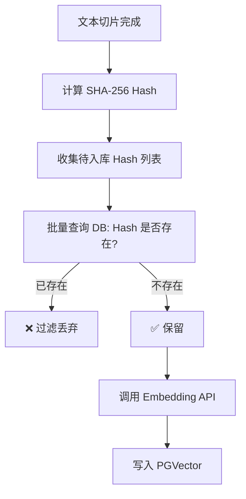

# chunk_hash 重复检测：向量库去重策略

## 1. 背景与痛点

在 RAG（检索增强生成）系统的实际运行中，经常会遇到以下情况：

1. **重复上传**：用户不小心多次上传同一个文件。
2. **内容冗余**：不同的文档包含完全相同的段落（例如公司的“免责声明”、“版权页”）。
3. **重试导致重复**：ETL 任务失败重试时，部分切片可能已经被写入。

如果不做去重，会导致：

* **💰 成本浪费**：重复调用 Embedding 模型（按 Token 收费）。
* **💾 存储膨胀**：向量数据库存入大量垃圾数据。
* **🔍 检索干扰**：搜索结果 Top 5 里可能全是同一段话的重复副本，挤占了其他有效信息的展示位。

---

## 2. 核心方案：基于内容的哈希指纹

我们采用 **SHA-256** 算法为每个文本切片生成唯一的“指纹” (`chunk_hash`)。

* **原理**：只要文本内容完全一致（标点、空格都一样），生成的 Hash 值就一定相同。
* **存储**：将 `chunk_hash` 作为元数据（Metadata）存入 PostgreSQL 的 `JSONB` 字段中。
* **策略**：**入库前检测**（Pre-ingestion Check）。在调用 Embedding API 之前，先检查数据库中是否已存在该 Hash。

### 2.1 流程图解



---

## 3. 关键技术实现

### 3.1 哈希计算 (`HashUtils`)

使用 Java 标准库 `MessageDigest` 计算 SHA-256，确保为每个切片生成唯一的文本指纹。

```java
public static String getSha256(String input) {
    // ... SHA-256 计算逻辑 ...
    return hexString.toString();
}
```

### 3.2 高效 JSONB 查询 (`DocumentChunkMapper`)

由于 `chunk_hash` 存储在 `metadata` (JSONB) 字段中，我们需要使用 PostgreSQL 特有的操作符 `->>` 来提取并查询。

为了避免 **N+1 查询问题**（即每条切片查一次库），我们实现了 **批量查询**：

```java
// MyBatis 自定义 SQL
@Select("<script>" +
        "SELECT metadata->>'chunk_hash' FROM vector_store " +
        "WHERE metadata->>'chunk_hash' IN " +
        "<foreach item='hash' collection='hashes' ...>" +
        "#{hash}" +
        "</foreach>" +
        "</script>")
List<String> selectExistingHashes(@Param("hashes") List<String> hashes);
```

> **性能优化建议**：当数据量达到百万级时，强烈建议为该 JSON 路径创建索引：
> ```sql
> CREATE INDEX idx_vector_store_chunk_hash ON vector_store ((metadata->>'chunk_hash'));
> ```

### 3.3 消费者集成 (`IngestionConsumer`)

在 ETL 流程中，我们将去重逻辑置于 **向量化之前**，这样能最大程度节省 Embedding 成本。

```java
// 1. 计算 Hash
String chunkHash = HashUtils.getSha256(chunkText);
chunkMeta.put("chunk_hash", chunkHash);

// 2. 查库去重
List<String> existingHashes = documentChunkMapper.selectExistingHashes(hashesToCheck);

// 3. 过滤
documents = documents.stream()
        .filter(doc -> !existingHashes.contains(doc.getMetadata().get("chunk_hash")))
        .collect(Collectors.toList());

// 4. 仅对新数据进行向量化和入库
if (!documents.isEmpty()) {
    vectorStore.add(documents);
}
```

---

## 4. 总结

通过引入 `chunk_hash` 重复检测，我们构建了一个 **幂等** 的文档处理流水线。无论上游任务重试多少次，或者用户上传多少次相同文件，向量数据库始终保持干净、紧凑。

*文档生成时间: 2024-05-21*