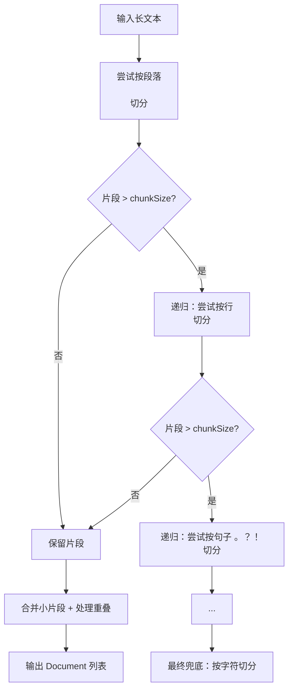

# 智能切片策略：按自然段/句子递归切分

## 1. 背景与痛点

在 RAG（检索增强生成）系统中，**文档切片 (Chunking)** 的质量直接决定了检索的准确率。

传统的 **"固定字符数切分"** (Fixed Size Splitting) 存在严重缺陷：

* **语义断裂**：一句话可能被切成两半，导致 LLM 无法理解上下文。
* **关键词丢失**：主语在上一块，谓语在下一块，导致向量检索时匹配度下降。

**示例（错误切分）**：
> 原文：Spring AI 是一个强大的框架。它简化了开发。
>
> *切片1*：Spring AI 是一个强大的框
> *切片2*：架。它简化了开发。

**目标**：我们需要一种 **"语义感知"** 的切分方式，尽可能在自然段落或句子的边界处断开。

---

## 2. 核心算法：递归字符切分

我们借鉴了 LangChain 的 `RecursiveCharacterTextSplitter` 思想，实现了一套 **递归降级** 策略。

### 2.1 分隔符优先级

算法会按顺序尝试以下分隔符，直到切分出的片段足够小（小于 `chunkSize`）：

1. **`\n\n` (双换行)**：优先按 **自然段落** 切分。这是保持语义最完整的粒度。
2. **`\n` (单换行)**：如果段落太长，尝试按 **行** 切分。
3. **`。？！.?!` (句子结束符)**：如果行太长，按 **句子** 切分。
4. **`，,；;` (子句分隔符)**：如果句子还太长，按 **子句** 切分。
5. **` ` (空格)**：按单词切分。
6. **`""` (字符)**：最后兜底，强制按字符切分。

### 2.2 流程图解



---

## 3. 关键技术细节

### 3.1 保护标点符号 (Regex Lookbehind)

普通的 `String.split("。")` 会把句号吃掉，导致切分后的句子没有标点。
我们使用了 **正则后顾断言 (Lookbehind)**：

```java
// 匹配 "。" 但不消耗它，匹配位置在 "。" 后面
String regex = "(?<=[。？！.?!])";
```

* **效果**：`"你好。再见。"` -> `["你好。", "再见。"]`
* **优势**：保留了句子的完整性，LLM 能够看到标点，理解语气。

### 3.2 碎片合并与重叠 (Overlap)

切分后的碎片（如单句话）通常很短。我们需要把它们重新组合成接近 `chunkSize` (默认 500) 的块。

* **合并**：`Chunk = 句子1 + 句子2 + ...`
* **重叠 (Overlap)**：为了保证块与块之间的连贯性，我们在切分点会保留约 50 个字符的重叠内容。
    * **实现机制**：**滑动窗口**。当当前块填满（> chunkSize）准备生成 Document 时，截取当前块**末尾**的 `chunkOverlap` 个字符，作为
      **下一个块的开头**。
    * **目的**：防止关键词（如主语）或逻辑连接词刚好位于切分边界而被丢弃，导致上下文丢失。

---

## 4. 代码实现与集成

### 4.1 智能切片器 (`SmartTextSplitter`)

位于 `src/main/java/org/zerolg/aidemo2/support/splitter/SmartTextSplitter.java`。

### 4.2 消费者集成 (`IngestionConsumer`)

在文档处理流水线中，我们替换了原有的简单切分逻辑：

```java
// ✅ 新逻辑：智能切分
List<String> chunks = smartTextSplitter.split(text);
```

---

## 5. 总结

通过引入 **智能语义切片**，我们实现了：

1. **语义完整**：优先在段落和句子边界切分，绝不打断语义。
2. **上下文连贯**：通过滑动窗口重叠机制，消除切分边界的“盲区”。
3. **检索精准**：保留了标点和上下文，生成的 Embedding 向量更能表征原意。

*文档生成时间: 2024-05-21*