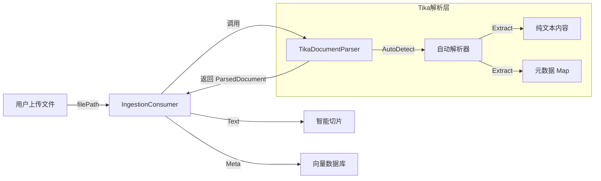

# Apache Tika 集成：全格式文档解析引擎

## 1. 背景与痛点

在构建企业级知识库时，我们面临的一个主要挑战是**数据源的多样性**。

* **现状**：之前的系统只能处理纯文本 (`String`) 或 JSON 中的 `text` 字段。
* **痛点**：企业内部的知识通常沉淀在 **PDF**、**Word (.docx)**、**Excel (.xlsx)**、**PPT** 等二进制文件中。如果不能解析这些格式，RAG
  系统就无法利用这些高价值信息。
* **目标**：引入一个统一的解析层，无论用户上传什么格式的文件，都能自动提取出**纯文本内容**和**元数据**（如作者、标题、页数）。

---

## 2. 核心方案：Apache Tika

我们选择了 Java 生态中最强大的内容分析工具包 —— **Apache Tika**。

### 2.1 为什么选择 Tika？

* **全格式支持**：支持 1000+ 种文件格式（PDF, Office, HTML, XML, 图片元数据等）。
* **自动检测**：无需告诉它文件是 PDF 还是 Word，它会根据文件头（Magic Number）自动识别。
* **元数据提取**：不仅能提取正文，还能提取 `Author`, `Title`, `Creation-Date` 等元数据，这对后续的混合检索非常有用。

### 2.2 架构位置

Tika 位于 **ETL 流水线** 的最前端：



---

## 3. 关键技术实现

### 3.1 统一解析服务 (`TikaDocumentParser`)

我们封装了一个独立的服务类，屏蔽了 Tika 的底层复杂性。

* **解除长度限制**：默认 Tika 对提取的字符数有限制（防止内存溢出）。我们使用 `new BodyContentHandler(-1)`
  解除了这个限制，确保大文档也能完整解析。
* **元数据转换**：将 Tika 的 `Metadata` 对象转换为 Java 的 `Map<String, Object>`，方便后续处理。

```java
public ParsedDocument parseDocument(String filePath) {
    // 1. 自动检测解析器
    Parser parser = new AutoDetectParser();
    // 2. 解除内容长度限制 (-1)
    BodyContentHandler handler = new BodyContentHandler(-1);
    Metadata metadata = new Metadata();
    
    // 3. 执行解析
    parser.parse(stream, handler, metadata, context);
    
    // 4. 封装结果
    return ParsedDocument.builder()
            .content(handler.toString())
            .metadata(toMap(metadata))
            .build();
}
```

### 3.2 数据模型封装 (`ParsedDocument`)

为了规范解析结果，我们定义了一个 DTO：

```java
@Data
public class ParsedDocument {
    private String content;              // 提取出的纯文本
    private Map<String, Object> metadata; // 提取出的元数据
}
```

### 3.3 消费者集成 (`IngestionConsumer`)

在 ETL 消费者中，我们增加了对 `filePath` 的判断逻辑，实现了**文件模式**与**文本模式**的兼容。

```java
// 1. 优先检查是否有文件路径
if (filePath != null) {
    // 调用 Tika 解析
    ParsedDocument doc = tikaDocumentParser.parseDocument(filePath);
    text = doc.getContent();
    // 合并元数据 (Tika 提取的 + 上传时附带的)
    metadata.putAll(doc.getMetadata());
}

// 2. 后续流程不变 (切片 -> 向量化 -> 入库)
```

---

## 4. 总结

通过集成 Apache Tika，我们的知识库摄入能力得到了质的飞跃：

1. **格式无忧**：支持几乎所有主流办公文档格式。
2. **信息丰富**：自动提取的元数据为未来的**元数据过滤（Metadata Filtering）**提供了数据基础。
3. **架构解耦**：解析逻辑封装在独立 Service 中，消费者只负责流程编排。

*文档生成时间: 2024-05-21*