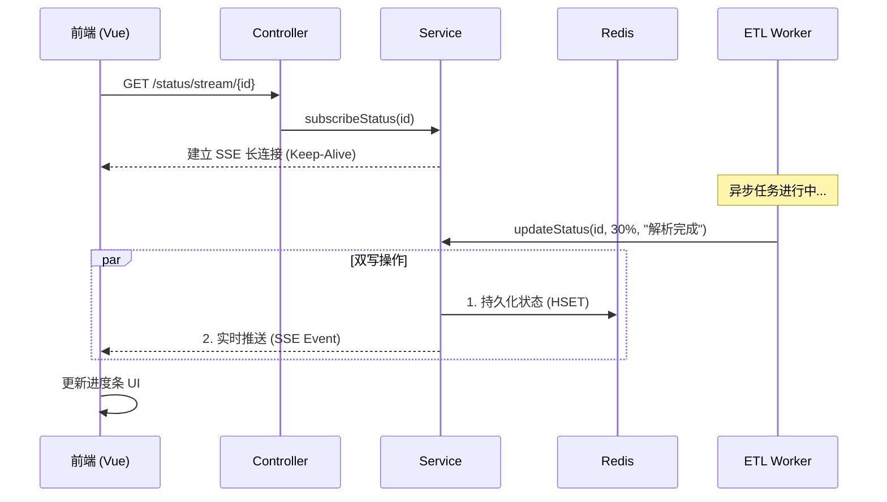

# 实时进度通知：SSE 与 Webhook

## 1. 背景与痛点

在 **文档 Ingestion (ETL)** 过程中，处理一个大文件（如 500页的 PDF）可能需要几十秒甚至更久。

* **传统做法 (轮询 Polling)**：前端每隔 1-3 秒调用一次查询接口 `/status/{id}`。
    * *缺点*：浪费服务器资源，网络开销大，且进度更新不及时（有延迟）。
* **目标**：实现 **服务器主动推送**。当后台处理进度变化（如从“解析中”变为“切片中”）时，前端能毫秒级收到通知，让进度条丝滑滚动。

---

## 2. 技术选型：为什么选择 SSE？

在“服务器向客户端推送”的场景下，主要有两种选择：

| 特性       | WebSocket    | SSE (Server-Sent Events) |
|:---------|:-------------|:-------------------------|
| **通信方向** | 双向 (全双工)     | **单向** (服务器 -> 客户端)      |
| **协议**   | TCP (需握手升级)  | HTTP (长连接)               |
| **复杂度**  | 高 (需处理心跳、重连) | **低** (浏览器原生支持)          |
| **适用场景** | 聊天室、多人游戏     | **进度条**、股票行情、日志流         |

**结论**：我们的场景只需要服务器汇报进度，不需要客户端发消息，因此 **SSE 是最轻量、最合适的选择**。

---

## 3. 架构设计与实现

### 3.1 核心流程

我们采用了 **"双写策略 (Dual Write)"** 来保证状态的实时性与持久性。



### 3.2 关键代码实现

#### 后端：连接管理 (`KnowledgeIngestionService`)

我们需要在内存中维护 `ingestionId` 到 `SseEmitter` 的映射关系。

```java
// 内存连接池 (单机版)
private final Map<String, SseEmitter> sseEmitters = new ConcurrentHashMap<>();

public void updateStatus(String id, IngestionStatus status, int progress, String msg) {
    // 1. 写 Redis (保证刷新页面后状态还在)
    redisTemplate.opsForHash().put(key, "status", status.name());

    // 2. 推 SSE (保证实时性)
    SseEmitter emitter = sseEmitters.get(id);
    if (emitter != null) {
        // 推送 JSON 数据
        emitter.send(SseEmitter.event().name("progress").data(Map.of(
                "progress", progress,
                "message", msg
        )));

        // 任务结束，断开连接
        if (status == COMPLETED || status == FAILED) {
            emitter.complete();
            sseEmitters.remove(id);
        }
    }
}
```

---

## 4. 总结

通过引入 SSE，我们实现了：

1. **用户体验提升**：进度条实时响应，不再卡顿。
2. **服务器减负**：消除了大量无效的轮询请求。
3. **架构闭环**：从上传 -> 处理 -> 推送，形成完整的异步任务链路。

*文档生成时间: 2024-05-21*