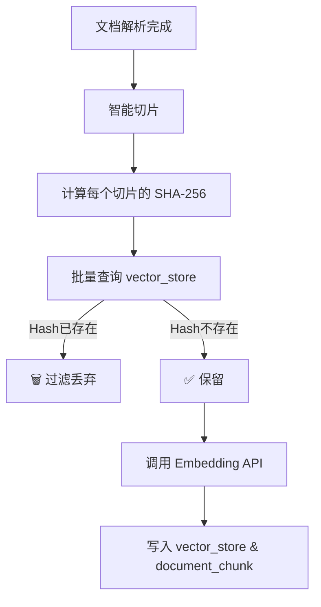

# 文件级与切片级双重去重：构建幂等知识库

## 1. 背景与痛点

在 RAG 系统的文档摄入（Ingestion）流程中，重复数据是成本和性能的杀手。我们需要解决两个层面的问题：

1. **完全重复上传**：用户误传了同一个文件，或者多人上传了同一份资料。
2. **部分内容冗余**：不同文档中包含相同的段落（如公司的“免责声明”），或者文档只修改了几个字重新上传。

**解决方案**：构建 **“双重去重防御体系”**。

* **第一道防线（文件级）**：秒级拦截完全重复的文件，节省解析计算资源。
* **第二道防线（切片级）**：精准过滤重复段落，节省向量存储和 Embedding 成本。

---

## 2. 第一道防线：文件级去重 (File-Level)

**目标**：在调用昂贵的 Tika 解析器之前，直接拦截重复文件。

* **指纹算法**：**MD5**。计算整个文件的二进制指纹。
* **存储位置**：关系型数据库表 `document_file`。
* **执行时机**：`IngestionConsumer` 收到消息后，解析文档前。

### 2.1 数据库设计 (`document_file`)

```sql
CREATE TABLE document_file (
    id VARCHAR(64) PRIMARY KEY,
    file_hash VARCHAR(64) NOT NULL, -- MD5 值
    filename VARCHAR(255),
    file_size BIGINT,
    status VARCHAR(20),             -- COMPLETED, FAILED
    create_time TIMESTAMP DEFAULT CURRENT_TIMESTAMP
);
-- 关键索引：加速查询
CREATE INDEX idx_document_file_hash ON document_file(file_hash);
```

### 2.2 拦截逻辑

```java
// 伪代码逻辑
String fileMd5 = HashUtils.getFileMd5(filePath);
boolean exists = documentFileMapper.exists(new LambdaQueryWrapper<DocumentFile>()
        .eq(DocumentFile::getFileHash, fileMd5)
        .eq(DocumentFile::getStatus, "COMPLETED")); // 仅拦截已成功处理的文件

if (exists) {
    logger.info("文件级去重命中: {}", filePath);
    return; // 直接结束，不进行 Tika 解析
}
```

---

## 3. 第二道防线：切片级去重 (Chunk-Level)

**目标**：在调用 Embedding API 之前，过滤掉内容完全一致的文本段落。

* **指纹算法**：**SHA-256**。计算切片文本内容的哈希。
* **存储位置**：向量数据库 `vector_store` 的 `metadata` (JSONB) 字段中，Key 为 `chunk_hash`。
* **执行时机**：`KnowledgeBaseService` 入库前。

### 3.1 流程图解



---

## 3. 关键技术实现

### 3.1 数据库设计 (`document_file`)

我们需要一张表来“记住”处理过的文件。

```sql
CREATE TABLE document_file (
    id VARCHAR(64) PRIMARY KEY,
    file_hash VARCHAR(64) NOT NULL, -- MD5 值
    filename VARCHAR(255),
    status VARCHAR(20),             -- COMPLETED, FAILED
    create_time TIMESTAMP
);
-- 关键索引：加速查询
CREATE INDEX idx_document_file_hash ON document_file(file_hash);
```

### 3.2 哈希计算工具 (`HashUtils`)

使用 Java 流式读取计算 MD5，避免一次性加载大文件导致内存溢出 (OOM)。

```java
public static String getFileMd5(String filePath) {
    try (InputStream fis = new FileInputStream(filePath)) {
        MessageDigest digest = MessageDigest.getInstance("MD5");
        byte[] buffer = new byte[8192]; // 8KB 缓冲区
        int n;
        while ((n = fis.read(buffer)) != -1) {
            digest.update(buffer, 0, n);
        }
        // ... 转十六进制字符串
        return hexString.toString();
    }
}
```

### 3.3 消费者集成 (`IngestionConsumer`)

在调用 Tika 解析器之前，先查库。

```java
// 1. 计算指纹
String fileMd5 = HashUtils.getFileMd5(filePath);

// 2. 查库 (只拦截状态为 COMPLETED 的，防止拦截之前失败的任务)
boolean exists = documentFileMapper.exists(new LambdaQueryWrapper<DocumentFile>()
        .eq(DocumentFile::getFileHash, fileMd5)
        .eq(DocumentFile::getStatus, "COMPLETED"));

if (exists) {
    logger.info("文件级去重命中: {}", filePath);
    updateStatus(ingestionId, COMPLETED, 100, "文件已存在，跳过处理");
    return; // 直接结束
}
```

---

## 4. 总结

结合之前的 **chunk_hash**，我们构建了 **双重去重防御体系**：

1. **文件级去重 (MD5)**：粗粒度、低成本。拦截 100% 重复的文件，节省解析资源。
2. **切片级去重 (SHA-256)**：细粒度、高精度。拦截部分修改的文件，节省向量存储空间。

*文档生成时间: 2024-05-21*