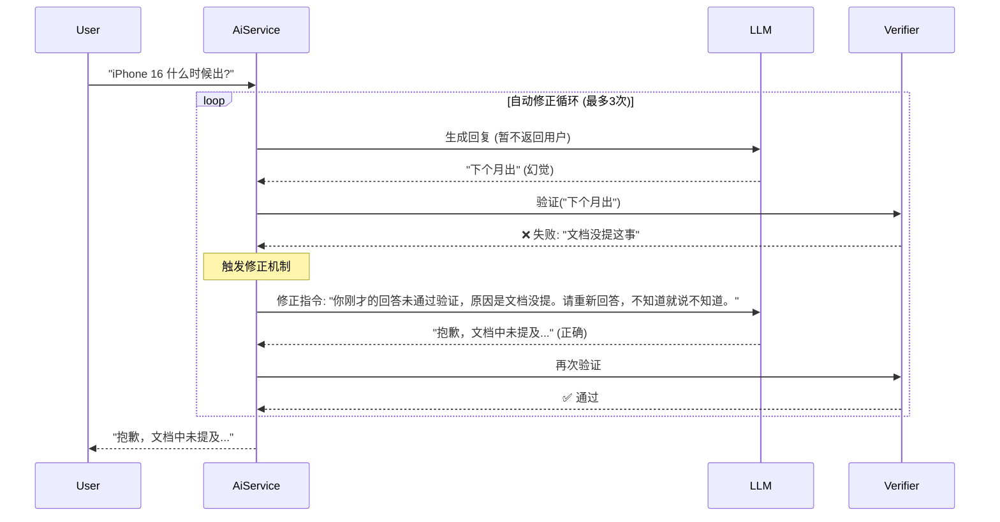

# 幻觉控制机制 (Verifier)：如何决定“警告”还是“通过”？

> 本文档旨在澄清 **幻觉控制 (Hallucination Control)** 的判断逻辑，纠正“LLM 生成即警告”的误区，详细解释系统是如何判定一条回答是否可信的。

---

## 1. 核心误区纠正

### ❌ 常见的误解

- **LLM 生成** -> ⚠️ 警告 (Warning)
- **RAG 检索** -> ✅ 已有文档依据 (Verified)

### ✅ 实际逻辑

- **所有的回答**，本质上都是 **LLM 生成** 的（RAG 只是把文档喂给 LLM，让它组织语言）。
- **判断标准**是：**生成的内容** 与 **检索到的文档** 是否**一致**。

> **公式**：
> - *生成内容* $\subseteq$ *检索文档* $\rightarrow$ **✅ 通过 (Verified)**
> - *生成内容* $\nsubseteq$ *检索文档* $\rightarrow$ **⚠️ 警告 (Warning)**

---

## 2. 真正的判断逻辑：Verifier 到底在查什么？

Verifier（裁判）并不关心这几句话是谁写的，它只关心 **“证据链”** 是否完整。它会拿着 **[检索到的文档]** 去核对 **[生成的回答]
**。

### 场景一：RAG 检索成功 + LLM 老实回答 -> ✅ 通过

- **用户**：“iPhone 15 电池多大？”
- **检索文档**：“iPhone 15 电池容量为 3349mAh。”
- **生成回答**：“iPhone 15 的电池容量是 3349mAh。”
- **裁判判定**：**通过**。
    - *理由*：回答里的每一个数据都能在文档里找到。

### 场景二：RAG 检索成功 + LLM 添油加醋 -> ⚠️ 警告 (幻觉)

> 这是最危险的情况，也是 Verifier 存在的意义。

- **用户**：“iPhone 15 有什么颜色？”
- **检索文档**：“iPhone 15 提供黑色、蓝色、绿色。”（文档里没提粉色）
- **生成回答**：“iPhone 15 有黑色、蓝色、绿色，**还有非常好看的粉色**。”
- **裁判判定**：**警告**。
    - *理由*：虽然前一半对了，但“粉色”在文档里找不到依据，属于 LLM 自己的“脑补”。**即使检索到了文档，也不能保证 LLM 不胡说。**

### 场景三：RAG 检索失败 + LLM 强行回答 -> ⚠️ 警告 (纯幻觉)

- **用户**：“明年的 iPhone 16 长什么样？”
- **检索文档**：(空)
- **生成回答**：“iPhone 16 可能会采用垂直摄像头排列...” (基于 LLM 训练时的公网知识)
- **裁判判定**：**警告**。
    - *理由*：企业级 Agent 要求严谨，文档里没有就是没有。凡是文档里没有的，哪怕 LLM 说对了，在企业内部也被视为“不可信来源”。

### 场景四：RAG 检索失败 + LLM 诚实拒答 -> ✅ 通过

- **用户**：“老板的私房钱藏哪了？”
- **检索文档**：(空)
- **生成回答**：“抱歉，知识库中没有相关信息。”
- **裁判判定**：**通过**。
    - *理由*：LLM 诚实地反映了“没有数据”这一事实，这种行为是符合预期的。

---

## 3. 为什么要有这个区分？

| 状态          | 前端展示     | 含义                                                |
|:------------|:---------|:--------------------------------------------------|
| **✅ 来源可信**  | 绿色盾牌 🛡️ | **放心用**。这句话的每一个字都有企业内部文档背书，出了事可以赖文档。              |
| **⚠️ 内容存疑** | 黄色警告 ⚠️  | **小心用**。这句话可能是对的（基于公网常识），也可能是错的（瞎编），但肯定不是企业官方确认的。 |

---

## 4. 总结

**“通过 (Verified)”** 的唯一标准是：**“信达雅”中的“信”**。

- 不管 LLM 怎么修饰语言（雅），怎么概括总结（达）。
- 只要它**不篡改数据、不无中生有**（信），Verifier 就会给它发 **✅**。
- 一旦它开始**自由发挥**，Verifier 就会立刻亮 **⚠️**。

---

## 5. 进阶方案：同步拦截与自动修正 (Strict Mode)

在这个模式下，AI 的工作流程变为：

1. **生成**：AI 生成完整回复（用户看不见）。
2. **审核**：Verifier 校验。
3. **决策**：
    - **通过** -> 发送给用户。
    - **不通过** -> 打回重写（将错误原因喂回给 AI，让它自我修正）。
    - **重试超限** -> 输出兜底回复“抱歉，我无法生成可信的回答”。

### 5.1 流程图



### 5.2 模式对比与商业化策略

| 特性       | 提醒模式 (Warning Mode)    | 拦截模式 (Strict Mode)      |
|:---------|:-----------------------|:------------------------|
| **目前状态** | ✅ 已实现 (SSE 流式 + 异步验证)  | 🆕 上述代码 (同步循环验证)        |
| **用户体验** | 极快 (打字机效果)             | 较慢 (像思考者，需等待几秒)         |
| **安全性**  | 中 (用户可能先看到错误信息)        | 高 (错误信息绝不出库)            |
| **适用场景** | 内部知识库、普通客服、非敏感数据       | 金融投顾、医疗建议、合同解读          |
| **成本**   | 1x Token + 1x Verifier | 可能会有 2-3 倍 Token (重试消耗) |

对于商业化项目，我建议采取**混合策略**：

- **默认使用“提醒模式”**：因为用户极其讨厌等待。90% 的场景下，RRF + Rerank 已经够准了，Verifier 只是作为一个 UI 上的补充提示。
- **敏感意图切换“拦截模式”**：
    - 当 LLM 检测到用户意图涉及 "资金"、"转账"、"签约" 等高风险操作时，自动切换到 `chatStrict` 接口。
    - 或者在前端增加一个 “深度严查模式” 开关，让用户自己选择“我要快”还是“我要准”。

> 这样既能控制真正的风险，又不会因为所有请求都慢 5 秒而吓跑用户。

---

## 6. 后端实现：新增核心类

请在项目中创建以下文件。

### 6.1 验证结果模型 (`src/main/java/org/zerolg/aidemo2/model/VerificationResult.java`)

```java
package org.zerolg.aidemo2.model;

public record VerificationResult(
        boolean passed,          // 是否通过验证
        double confidence,       // 置信度 (0.0 - 1.0)
        String reason,           // 判决理由
        String correction        // 修正建议 (可选)
) {
}
```

### 6.2 裁判提示词模板 (`src/main/resources/static/verifier-prompt.st`)

```text
你是一个极其严格的事实核查员 (Fact Checker)。
你的任务是验证【AI回复】是否完全基于【背景知识】生成，是否存在幻觉或未授权的推断。

【背景知识】：
{context}

【用户问题】：
{query}

【AI回复】：
{response}

请执行以下检查步骤：
1. **事实一致性**：AI回复中的每一个数据（数字、日期、人名），是否都能在背景知识中找到原文依据？
2. **无中生有**：AI是否编造了背景知识中不存在的内容？
3. **逻辑推断**：AI的推断是否合理且严谨？

请输出 JSON 格式结果，不要包含 Markdown 标记：
{
"passed": true/false,  // 只要发现任何不支持的事实，必须为 false
"confidence": 0.9,     // 0.0-1.0
"reason": "简述判断理由...",
"correction": "如果未通过，提供简短修正建议；如果通过，留空"
}
```

### 6.3 验证服务 (`src/main/java/org/zerolg/aidemo2/service/VerifierService.java`)

```java
package org.zerolg.aidemo2.service;

import org.slf4j.Logger;
import org.slf4j.LoggerFactory;
import org.springframework.ai.chat.client.ChatClient;
import org.springframework.ai.chat.prompt.PromptTemplate;
import org.springframework.ai.converter.BeanOutputConverter;
import org.springframework.ai.document.Document;
import org.springframework.beans.factory.annotation.Value;
import org.springframework.core.io.Resource;
import org.springframework.stereotype.Service;
import org.zerolg.aidemo2.model.VerificationResult;
import reactor.core.publisher.Mono;
import reactor.core.scheduler.Schedulers;

import java.util.List;
import java.util.Map;
import java.util.stream.Collectors;

@Service
public class VerifierService {

    private static final Logger logger = LoggerFactory.getLogger(VerifierService.class);
    private final ChatClient chatClient;

    @Value("classpath:/static/verifier-prompt.st")
    private Resource verifierPromptResource;

    public VerifierService(ChatClient chatClient) {
        this.chatClient = chatClient;
    }

    public Mono<VerificationResult> verify(String query, List<Document> documents, String response) {
        return Mono.fromCallable(() -> {
                    String contextStr = documents.stream()
                            .map(Document::getContent)
                            .collect(Collectors.joining("\n---\n"));

                    if (contextStr.isEmpty()) {
                        // 无上下文时，视为无法验证或通过（视业务而定）
                        return new VerificationResult(true, 0.5, "无背景知识，跳过验证", null);
                    }

                    PromptTemplate promptTemplate = new PromptTemplate(verifierPromptResource);
                    String prompt = promptTemplate.render(Map.of(
                            "context", contextStr,
                            "query", query,
                            "response", response
                    ));

                    BeanOutputConverter<VerificationResult> converter = new BeanOutputConverter<>(VerificationResult.class);
                    // 建议设置 temperature=0 确保稳定，此处复用默认配置
                    String jsonResult = chatClient.prompt().user(prompt).call().content();

                    return converter.convert(jsonResult);
                }).subscribeOn(Schedulers.boundedElastic())
                .onErrorResume(e -> {
                    logger.error("验证服务异常", e);
                    return Mono.just(new VerificationResult(true, 0.0, "验证服务不可用", null));
                });
    }
}
```

---

## 7. 后端更新：`AiService.java` (最终版)

> 核心逻辑：
> - 保留所有会话管理逻辑（Check -> Save User -> Get History -> Save Assistant）。
> - 集成 `RagService` 的混合检索。
> - 集成 `VerifierService` 的幻觉审计。
> - 升级返回类型为 `Flux<ServerSentEvent<String>>`。

### 文件路径: `src/main/java/org/zerolg/aidemo2/service/AiService.java`

```java
package org.zerolg.aidemo2.service;

import com.fasterxml.jackson.core.JsonProcessingException;
import com.fasterxml.jackson.databind.ObjectMapper;
import org.slf4j.Logger;
import org.slf4j.LoggerFactory;
import org.springframework.ai.chat.client.ChatClient;
import org.springframework.ai.chat.messages.AssistantMessage;
import org.springframework.ai.chat.messages.Message;
import org.springframework.ai.chat.messages.UserMessage;
import org.springframework.ai.chat.prompt.PromptTemplate;
import org.springframework.ai.document.Document;
import org.springframework.beans.factory.annotation.Value;
import org.springframework.core.io.Resource;
import org.springframework.http.codec.ServerSentEvent;
import org.springframework.stereotype.Service;
import org.zerolg.aidemo2.model.SessionMessage;
import org.zerolg.aidemo2.properties.SessionProperties;

import reactor.core.publisher.Flux;
import reactor.core.publisher.Mono;

import java.util.List;
import java.util.Map;
import java.util.stream.Collectors;

@Service
public class AiService {

    private static final Logger logger = LoggerFactory.getLogger(AiService.class);

    private final ChatClient chatClient;
    private final RagService ragService;
    private final SessionMemoryService sessionMemoryService;
    private final SessionProperties sessionProperties;
    private final VerifierService verifierService;
    private final ObjectMapper objectMapper;
    private final String[] availableTools;

    @Value("classpath:/static/rag-enhanced-prompt.st")
    private Resource ragEnhancedPromptResource;

    public AiService(
            ChatClient.Builder chatClientBuilder,
            RagService ragService,
            SessionMemoryService sessionMemoryService,
            VerifierService verifierService,
            SessionProperties sessionProperties,
            ObjectMapper objectMapper,
            List<String> availableToolNames) {

        this.availableTools = availableToolNames.toArray(new String[0]);
        // 在构造函数中统一挂载工具
        this.chatClient = chatClientBuilder
                .defaultFunctions(this.availableTools)
                .build();
        this.ragService = ragService;
        this.sessionMemoryService = sessionMemoryService;
        this.sessionProperties = sessionProperties;
        this.verifierService = verifierService;
        this.objectMapper = objectMapper;

        logger.info("AiService 初始化完成, 加载工具: {}", availableToolNames);
    }

    /**
     * 处理用户查询
     * 返回类型升级为 Flux<ServerSentEvent<String>> 以支持多事件类型
     */
    public Flux<ServerSentEvent<String>> processQuery(String chatId, String msg) {
        logger.info("开始处理查询: chatId={}, msg={}", chatId, msg);

        // ==================== 1. 会话管理 (保留) ====================
        if (!sessionMemoryService.sessionExists(chatId)) {
            sessionMemoryService.createSession(chatId, "default-user");
        }

        // ==================== 2. 保存用户消息 (保留) ====================
        int userTokens = estimateTokens(msg);
        SessionMessage userMessage = SessionMessage.createUserMessage(msg, userTokens)
                .withMetadata("userId", "default-user")
                .withMetadata("source", "web");
        sessionMemoryService.saveMessage(chatId, userMessage);

        // ==================== 3. 获取历史消息 (保留) ====================
        int maxHistoryTokens = sessionProperties.getMaxPromptTokens() - userTokens - 1000;
        List<SessionMessage> historyMessages = sessionMemoryService.getMessagesByTokenLimit(
                chatId,
                maxHistoryTokens
        );

        // ==================== 4. 混合检索 & 生成 (升级) ====================
        return ragService.retrieveAndRerank(msg)
                .flatMapMany(finalDocuments -> {

                    // 4.1 构建 RAG Prompt
                    String ragContext = finalDocuments.stream()
                            .map(Document::getFormattedContent)
                            .collect(Collectors.joining("\n\n"));

                    PromptTemplate systemPromptTemplate = new PromptTemplate(ragEnhancedPromptResource);
                    String systemText = systemPromptTemplate.render(Map.of(
                            "context", ragContext.isEmpty() ? "暂无相关背景知识。" : ragContext
                    ));

                    List<Message> messages = historyMessages.stream()
                            .map(this::convertToSpringAiMessage)
                            .collect(Collectors.toList());
                    messages.add(new UserMessage(msg));

                    // 4.2 流式生成
                    StringBuilder fullResponse = new StringBuilder();

                    return chatClient.prompt()
                            .system(systemText)
                            .messages(messages)
                            // .toolNames(availableTools) // 已在构造函数配置
                            .stream()
                            .content()
                            .map(chunk -> {
                                fullResponse.append(chunk);
                                // 包装为 message 事件
                                return ServerSentEvent.builder(chunk).event("message").build();
                            })
                            // ==================== 5. 保存 AI 回复 (保留) ====================
                            .doOnComplete(() -> {
                                String response = fullResponse.toString();
                                int assistantTokens = estimateTokens(response);
                                SessionMessage assistantMessage = SessionMessage.createAssistantMessage(
                                        response,
                                        assistantTokens
                                );
                                sessionMemoryService.saveMessage(chatId, assistantMessage);
                                logger.info("AI 回复已保存: tokens={}", assistantTokens);
                            })
                            // ==================== 6. 幻觉验证 (新增) ====================
                            .concatWith(Mono.defer(() -> {
                                return verifierService.verify(msg, finalDocuments, fullResponse.toString())
                                        .map(result -> {
                                            try {
                                                String json = objectMapper.writeValueAsString(result);
                                                return ServerSentEvent.builder(json).event("verification").build();
                                            } catch (JsonProcessingException e) {
                                                return ServerSentEvent.<String>builder().build();
                                            }
                                        });
                            }));
                });
    }

    private Message convertToSpringAiMessage(SessionMessage sessionMessage) {
        String role = sessionMessage.role();
        String content = sessionMessage.content();
        return switch (role) {
            case "user" -> new UserMessage(content);
            case "assistant" -> new AssistantMessage(content);
            default -> new UserMessage(content);
        };
    }

    private int estimateTokens(String text) {
        if (text == null || text.isEmpty()) return 0;
        long chineseChars = text.chars().filter(c -> c >= 0x4E00 && c <= 0x9FA5).count();
        long otherChars = text.length() - chineseChars;
        return Math.max(1, (int) (chineseChars / 1.5 + otherChars / 4.0));
    }
}
```

---

## 8. 前端更新：`index.html` (最终版)

> 核心修改：使用 `EventSource` 监听 `message` 和 `verification` 事件，新增徽章样式。

*(前端代码部分省略)*
