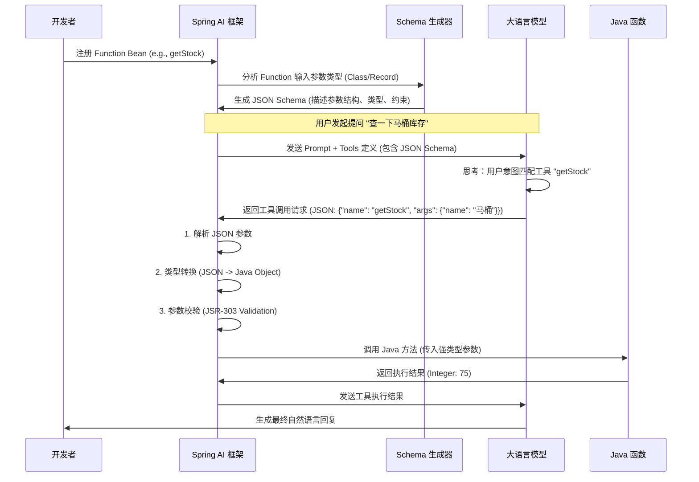

# Spring AI Function Calling 深度解析与最佳实践指南

本文档将深入剖析 Spring AI 如何实现 Function Calling，揭示其底层原理，并提供企业级的开发规范和示例。

## 1. 底层原理：从 Java 代码到 LLM 的奇幻漂流

当你定义一个 Java `Function` 并注册给 Spring AI 时，幕后发生了一系列复杂的转换过程。

### 1.1 核心流程图解



### 1.2 关键机制解析

#### A. JSON Schema 生成机制
Spring AI 不会直接把 Java 代码发给 LLM，而是将其翻译成 LLM 能听懂的 "通用语言" —— **JSON Schema**。

*   **输入**: Java Class / Record
*   **工具**: 内部使用 Jackson Module JSON Schema 或类似库。
*   **转换规则**:
    *   `String` -> `{"type": "string"}`
    *   `int/Integer` -> `{"type": "integer"}`
    *   `List<String>` -> `{"type": "array", "items": {"type": "string"}}`
    *   `@Description` -> `"description": "..."` (帮助 LLM 理解字段含义)
    *   `@JsonProperty(required=true)` -> `"required": [...]`

#### B. 为什么参数是安全的？
1.  **契约约束 (Schema)**: LLM 必须严格按照 JSON Schema 的格式输出 JSON。如果 Schema 说这是一个 `integer`，LLM 极大概率会输出数字。
2.  **框架转换 (Conversion)**: Spring AI 使用 Jackson 将 LLM 返回的 JSON 字符串反序列化为 Java 对象。如果类型不匹配（例如 LLM 返回了字符串 "abc" 给 int 字段），反序列化阶段就会抛出异常，**根本不会进入你的业务逻辑**。
3.  **业务校验 (Validation)**: 在进入业务逻辑前，还可以叠加 JSR-303 校验（如 `@NotNull`, `@Min`），进一步确保数据合法。

---

## 2. 企业级开发规范示例

为了保证 100% 的稳健性，建议放弃简单的 `Function<String, String>`，改用 **Request DTO (Record)** 模式。

### 2.1 定义强类型的 Request DTO

使用 Java `record` (推荐) 或 `class` 定义参数结构。利用注解丰富元数据。

```java
import com.fasterxml.jackson.annotation.JsonProperty;
import com.fasterxml.jackson.annotation.JsonPropertyDescription;
import jakarta.validation.constraints.Max;
import jakarta.validation.constraints.Min;
import jakarta.validation.constraints.NotBlank;
import jakarta.validation.constraints.Pattern;

public record ProductQueryRequest(
    
    @JsonProperty(required = true)
    @JsonPropertyDescription("产品名称，例如：智能马桶、洗脸盆") // 提示 LLM 应该填什么
    @NotBlank(message = "产品名称不能为空") // 业务校验
    String productName,

    @JsonPropertyDescription("仓库区域代码，可选。默认查询主仓")
    @Pattern(regexp = "^[A-Z]{2}\\d{3}$", message = "区域代码格式必须为2位大写字母+3位数字")
    String regionCode,

    @JsonPropertyDescription("查询数量限制，用于分页")
    @Min(1) @Max(100)
    Integer limit
) {}
```

### 2.2 编写健壮的 Function Bean

```java
@Configuration
public class InventoryTools {

    private static final Logger logger = LoggerFactory.getLogger(InventoryTools.class);

    @Bean
    @Description("高级库存查询工具，支持按区域和数量筛选") // 工具级别的描述
    public Function<ProductQueryRequest, InventoryResult> queryInventory() {
        return request -> {
            // 1. 此时 request 对象已经被 Spring AI 实例化并填充了数据
            // 类型转换错误已经在框架层被拦截了
            
            try {
                // 2. 手动触发 JSR-303 校验 (可选，如果框架未自动触发)
                // ValidatorFactory.buildDefaultValidatorFactory().getValidator().validate(request)...
                
                logger.info("工具调用: {}", request);
                
                // 3. 处理可选参数默认值
                String region = request.regionCode() != null ? request.regionCode() : "CN001";
                int limit = request.limit() != null ? request.limit() : 10;

                // 4. 执行业务逻辑
                return inventoryService.search(request.productName(), region, limit);

            } catch (Exception e) {
                // 5. 异常处理：返回友好的错误信息给 LLM，让它知道发生了什么
                logger.error("查询失败", e);
                // 返回特定错误对象，而不是抛出异常中断对话
                return new InventoryResult("ERROR", "查询出错: " + e.getMessage());
            }
        };
    }
}
```

---

## 3. 最佳实践总结

1.  **使用 Record 作为入参**: 结构清晰，不可变，天然适配 JSON 序列化。
2.  **详细的注解**:
    *   `@Description` (Bean上): 告诉 LLM **这个工具是干嘛的**。
    *   `@JsonPropertyDescription` (字段上): 告诉 LLM **这个字段该填什么**。
3.  **防御性编程**:
    *   不要信任 LLM 的非必填字段，代码中要处理 `null`。
    *   捕获业务异常，返回错误描述字符串，而不是让程序崩溃。这样 LLM 可以看到错误信息并尝试自我修正或告知用户。
4.  **保持原子性**: 一个工具只做一件事。如果逻辑复杂，拆分成多个工具。

通过遵循这套规范，你可以将 "不可控" 的自然语言交互，转化为 "严格可控" 的 Java 方法调用。
